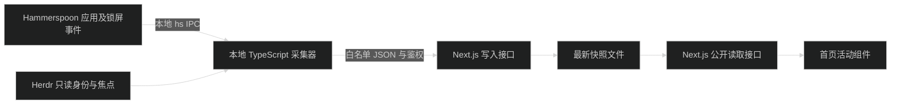

# 本地活动设计

## 边界

保留 Next.js 单应用。新增本地采集脚本，不改三个 AI CLI，不建第二个后端服务。Hammerspoon 负责系统事件，运行于 Herdr 会话的 Node/TypeScript 采集脚本负责合并精简状态并发送 HTTP。

## 文件归属

- `scripts/presence/`：本地采集器、Hammerspoon 模块源码、启动和安装说明；脚本不进入浏览器 bundle。
- `~/.hammerspoon/presence.lua`：安装后的本机副本，修改前备份；`init.lua` 只调整必要入口，不覆盖用户其他配置。
- `src/lib/presence.ts`：允许标识、传输类型、运行时校验和状态投影等无平台依赖逻辑。
- `src/lib/presence-store.ts`：仅服务端的最新状态读写和过期判断。
- `src/app/api/presence/route.ts`：公开 GET，只返回精简视图。
- `src/app/api/presence/report/route.ts`：鉴权 POST，拒绝未知字段、超大数据、非法标识。
- `src/app/(site)/_components/home/presence.tsx`：客户端轮询和展开交互，由现有 Hero 引用。
- `public/images/presence/`：已核实的应用图标；优先从已安装应用提取，缺少来源的 CLI 使用清晰文字标识，不编造品牌图标。

## 数据与状态

采集每 2 秒串行执行一次，前一轮没结束不重叠。系统事件更新由 Hammerspoon 完成；Node 只读精简快照，Herdr 只调用只读 JSON 命令。不记录完整工具响应，子进程限制超时和输出大小。

上报固定 schemaVersion、availability（active/hidden）、desktopApp（白名单 ID 或 null）、foregroundTool（pi/agy/claude/null）、backgroundTools（去重白名单 ID）、terminalDetection（known/unknown）。不接收任意应用名称、图标 URL、客户端任意过期时间、路径和命令内容。当前前台工具从后台列表排除；同工具有其他实例时可在后台保留该工具，由映射测试覆盖。

只有可信 Ghostty 前台、Herdr 窗格焦点和宿主对应关系同时成立，才能显示终端当前工具。Herdr 返回失败或无法确认宿主时 foregroundTool 为 null，terminalDetection 为 unknown，不复用旧数据。

锁屏、休眠和停止时清空应用及全部工具。非白名单 GUI 清空当前应用，已识别的后台工具可以继续显示。运行中只表示存在识别到的工具实例；不使用 agent_status 判断生成过程。

服务端以接收时间生成 ISO receivedAt 和 expiresAt，15 秒失效。客户端每 2 秒读取，页面隐藏时暂停，恢复可见立即刷新；请求失败或本地时钟达到过期时间就撤下旧活动。响应 no-store，不修改文章的数据读取方式。

## 存储与访问

最新快照保存为 `.cache/presence/state.json`，忽略 Git，串行原子替换，只保存最新一条，不建数据库、不保存历史。该选择对应当前单机验证及既有自托管 Next.js，不宣称支持多副本或无持久文件系统的部署。

写入使用服务端 `PRESENCE_TOKEN` Bearer 鉴权，密钥缺失时接口禁用，不能降级为匿名写入。本地密钥在实施时生成并写入被忽略的本地环境文件，不打印、不进入 NEXT_PUBLIC。采集器只允许回环 URL，本次不配置远程地址。验证服务绑定 127.0.0.1；不信任伪造的转发头。

## 展示

头像附近一行应用图标与活动名称；展开显示后台工具列表。保持现有 Hero 标题与主要按钮。键盘和手机可点击操作，不只靠 hover。GUI 文案为正在使用，后台文案为运行中，未知焦点不使用正在使用。离线不保留上一次应用。QQ 音乐只显示应用，不显示曲目或假定播放。

## 回退和风险

- 采集器中断：15 秒后失效；恢复运行重新上报。
- 锁屏通知丢失：Hammerspoon 读取快照时需同时确认当前会话锁定状态；无法可靠取得时不得公开旧活动。
- Herdr 不可用：桌面状态独立工作，终端焦点未知，清除终端旧值。
- 停止命令必须让采集器停止，或令 Hammerspoon 标记 hidden 且不再被轮询恢复为 active。
- 多 Herdr 客户端/多 Ghostty 窗口焦点无法对应时明确未知，不以最近操作猜测。
- 恢复本机备份并 reload 可移除本次安装；仓库改动由用户决定保留，不运行破坏性 Git 命令。
- 无修改 Pi/agy/claude 插件的需要，故不进入各自扩展实现。
