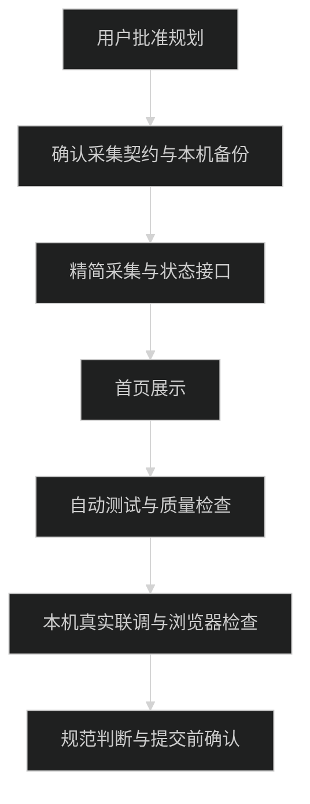

# 实施计划

当前仅完成规划，用户批准最新摘要后才允许启动实施。

## 顺序

- [x] 读取 frontend 规范、相关技能及规划产物，检查工作区和本机 Hammerspoon 配置；修改本机文件前保留备份。
- [x] 完成纯函数测试：桌面白名单、CLI 身份映射、焦点与后台判定、同工具去重、unknown、隐藏和过期状态、非法报告。
- [x] 核对 Hammerspoon 锁定状态 API 和 Herdr 只读身份/焦点字段；采集器不读取窗格正文、窗口标题或原始响应。
- [x] 增加 Hammerspoon 精简快照模块和 TypeScript 采集器，保留 `start` / `stop`，不改 Pi、agy、Claude 配置。
- [x] 增加 Bearer 鉴权、固定 schema 校验、请求体大小限制、最新快照原子写入和公开读取接口。
- [x] 在被忽略的 `.env.local` 中配置本地密钥；采集器拒绝非回环 HTTP 上报地址，快照目录加入 `.gitignore`。
- [x] 增加首页活动组件、应用图标和键盘/移动端展开关闭交互；保留原 Hero 文案和按钮。
- [x] 更新 README 的本地启动、停止、检查命令和功能状态。
- [x] 运行自动测试、`pnpm typecheck`、`pnpm lint`、`pnpm format:check` 和 `pnpm build`。
- [x] 复用 `http://localhost:4400` 开发服务完成本地联调；没有终止未知进程。
- [x] 真实验证 QQ、VS Code、Ghostty、ChatGPT、Antigravity、QQ 音乐、WorkBuddy 的 GUI 白名单映射；Ghostty 前台时真实识别 Pi，切出后 Pi 作为后台工具。
- [x] 对 agy、Claude 完成身份、后台和双焦点规则的自动测试；它们本轮没有自然运行，未宣称完成真实进程联调。
- [x] 使用浏览器检查桌面和 390×844 移动布局、活动详情展开/关闭、在线/离线清除和横向溢出；记录 QQ 约 2.2 秒、Pi 约 4.5 秒更新。
- [x] 按 `trellis-check` 清单完成内联全范围复查；尝试 dispatch 检查子代理时因全局缺少 `@earendil-works/pi-server` 失败，未改用未授权的替代依赖。
- [x] 使用 `trellis-update-spec` 记录本地活动接口、TTL、隐私边界和 Hammerspoon 快照刷新规则。
- [x] 按用户明确的“本次不提交 Git、不公网部署”要求跳过提交和部署，保留工作区改动供用户审阅。

## 验证记录

- `pnpm presence:test`：8 个测试全部通过。
- `pnpm typecheck`：通过。
- `pnpm lint`：通过。
- `pnpm format:check`：通过。
- `pnpm build`：通过，生成 `/api/presence` 和 `/api/presence/report` 动态路由。
- 接口检查：错误 token `401`，焦点冲突报告 `400`，超过 2048 字节 `413`；有效报告可写入，停止后立即离线，16 秒无心跳后离线。
- GUI 检查：7 个已核对 Bundle ID 均得到对应白名单 ID；真实 Herdr 会话当前识别 Pi。
- 浏览器检查：`http://localhost:4400/` 显示当前应用/终端、后台 Pi 和 `运行于 Ghostty`；桌面宽度与移动宽度均无横向溢出。
- 本机最终状态：已运行 `pnpm presence:stop`，Hammerspoon 监听和服务端活动均已清除。
## 回退点

- 本机配置修改前保留备份；失败时仅恢复本次替换部分，不覆盖用户随后修改。
- 本地采集器可以独立停止，不要求退出 Hammerspoon、Herdr、Ghostty 或 AI 工具。
- `.env.local` 只增补本任务变量，不整体覆盖；停止任务不删除用户已有环境配置。
- 不改 Homebrew tap，不修复上轮发现的无关 tap 更新问题。
