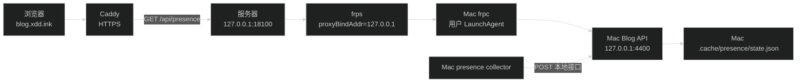

# 线上 Blog 读取 Mac 活动接口设计

## 1. 目标和边界

线上 `blog.xdd.ink` 的首页通过同源 `GET /api/presence` 显示 Mac 的公开活动。Mac collector 仍向 Mac 本地 Blog API 上报，服务器只通过已有 frp 连接读取 Mac API，不改变活动报告协议。

本任务涉及三套运行配置：

- Mac `/Users/wuwanzhu/.config/frp/frpc.toml`：增加一个从服务器回到 Mac localhost 的 TCP 代理。
- 服务器 `/etc/frp/frps.toml`：允许新的本机监听端口 `18100`。
- 服务器 `/home/deploy/projects/reverse-proxy/Caddyfile`：将精确的 `GET /api/presence` 转发到 `127.0.0.1:18100`。

Blog GitHub Actions 不负责这些长期进程。Blog 仓库只在活动组件增加请求 deadline，并更新维护文档和任务记录，不改变 API schema、collector 或 CI/CD workflow。

## 2. 数据流



请求方向由服务器发起，但实际 TCP 通道由 Mac frpc 主动连接服务器 `frps:7000` 建立。服务器端的 `18100` 只绑定回环地址，因此没有新增公网 TCP 入口。

### 正常读取

1. Mac 手动运行 `pnpm dev`，监听本机 `4400`。
2. Mac presence LaunchAgent 上报到 Mac `POST /api/presence/report`。
3. Mac frpc 将 Mac `127.0.0.1:4400` 映射到服务器 `127.0.0.1:18100`。
4. Caddy 收到线上 `GET /api/presence` 后转发到 `127.0.0.1:18100`。
5. Mac Blog API 从 Mac 的状态文件读取快照并返回，前端继续使用现有 2 秒轮询。

### 失败和恢复

- Mac `pnpm dev` 未运行：frpc 进程仍可在线，但转发连接失败；Caddy 在 5 秒响应头 deadline 后返回上游错误，前端活动请求在 6 秒 deadline 内取消并显示 offline。
- Mac frpc 未运行：服务器 `18100` 没有可用代理，Caddy 上游失败，前端活动请求显示 offline。
- Mac API 或 frpc 恢复：下一次轮询成功后页面重新显示 Mac 最新状态。
- 服务器自身 Blog API 仍保留原路由，但 Caddy 的精确 GET matcher 优先把线上活动读取转到 Mac；服务器 `POST /api/presence/report` 不经过该 matcher。

## 3. 配置合同

### Mac frpc

在现有 `/Users/wuwanzhu/.config/frp/frpc.toml` 追加：

```toml
[[proxies]]
name = "xdd-blog-presence"
type = "tcp"
localIP = "127.0.0.1"
localPort = 4400
remotePort = 18100
```

不改已有 `code-server`、XDD Core、GBDP 和 SSH 代理。继续使用已有的 `ink.xdd.frpc` LaunchAgent 和 frp 认证配置。

### 服务器 frps

保持：

```toml
bindPort = 7000
proxyBindAddr = "127.0.0.1"
```

在 `allowPorts` 增加：

```toml
{ single = 18100 }
```

不把 `18100` 加到公网防火墙放行列表；服务器本机 Caddy 通过回环地址访问。

### Caddy

在 `blog.xdd.ink` 站点的通用反代之前加入：

```caddyfile
@presenceGet {
    method GET
    path /api/presence
}

handle @presenceGet {
    reverse_proxy 127.0.0.1:18100 {
        transport http {
            response_header_timeout 5s
        }
    }
}

reverse_proxy 127.0.0.1:4400
```

`GET /api/presence` 是现有公开快照接口，不包含 token。`POST /api/presence/report` 不匹配 `presenceGet`，继续落到服务器 Blog；本任务不把采集 token 发送到服务器，也不让公网调用 Mac 的写入接口。

## 4. 生命周期

- Mac Blog API：由用户手动执行 `pnpm dev`，本任务不创建新的 macOS 服务。
- Mac frpc：沿用 `~/Library/LaunchAgents/ink.xdd.frpc.plist`，修改配置后 `launchctl kickstart -k gui/$(id -u)/ink.xdd.frpc`。
- 服务器 frps：沿用 `frps.service`，修改配置后通过 SSH 执行 `sudo systemctl restart frps`。
- 服务器 Caddy：沿用 Docker Compose 服务，修改后先 `caddy validate`，再 `docker compose restart caddy`。
- Blog CI/CD：只发布 Blog 代码；本任务不增加 workflow 步骤，也不让 deploy 因 Mac 暂时离线而失败。

## 5. 安全和隐私

- frps 的 `proxyBindAddr = "127.0.0.1"` 限制服务器远端端口只供服务器本机使用。
- Caddy 只代理精确 GET 活动路径；不代理 `/api/presence/report` 到 Mac。
- 活动响应仍由 Blog 的 `toPublicPresence` 投影，只有白名单应用和工具标识，没有 token、窗口标题、命令、路径或终端正文。
- 活动组件对 GET 请求设置 6 秒 deadline；超时和 Caddy 上游错误都显示 offline，不改变 2 秒轮询间隔。
- 不把 frp auth token、`PRESENCE_TOKEN`、SSH 私钥或服务器敏感配置写进 Blog 仓库、GitHub Actions 或 Caddyfile。
- 修改前对三份运行配置做带时间戳备份，日志检查只匹配状态和错误，不打印配置密钥。

## 6. 回滚

1. 从 Mac frpc 配置删除 `xdd-blog-presence`，重启已有 frpc。
2. 从服务器 frps `allowPorts` 删除 `18100`，重启 `frps.service`。
3. 从 Caddy Blog 站点删除 `presenceGet` 和对应 `handle`，保留原来的 `reverse_proxy 127.0.0.1:4400`。
4. 校验并重载 Caddy，确认 `https://blog.xdd.ink/` 恢复原路由。
5. 不删除 Mac presence runtime、Blog API 或状态 schema。

如果 Mac 离线，线上活动 GET 可能短暂返回上游错误；前端将其显示为 offline。恢复原 Caddy 反代后，线上 Blog 不再依赖 frp。

## 7. 验证重点

- 配置语法和服务状态：frpc verify、`launchctl print`、`frps.service`、`ss`、Caddy validate。
- 传输链路：服务器本机 `curl http://127.0.0.1:18100/api/presence`，再检查 `https://blog.xdd.ink/api/presence`。
- 路由隔离：检查主页仍为 200，`POST /api/presence/report` 不被 Caddy 转到 Mac，不能打印或提交 token。
- 断线恢复：分别停止 Mac Blog API 和 frpc，确认 Caddy 在 5 秒内返回上游错误，浏览器在 6 秒内显示 offline；恢复后确认活动重新出现。
- 部署隔离：运行 Blog 质量门，确认 workflow 文件和 GitHub Environment 不需要新配置。
