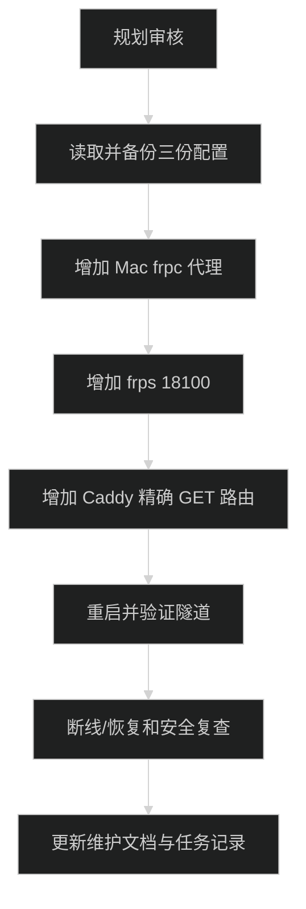

# 线上 Blog 接入实施计划

当前状态：in_progress。已完成三份生产配置的备份、修改、校验、重启和端到端链路检查。



## 变更边界

- 最小行为差距：线上 `blog.xdd.ink/api/presence` 当前读取服务器状态；目标是读取 Mac 本地 Blog API 的公开状态。
- 行为实际所在位置：跨机通道由 Mac frpc、服务器 frps 和 Caddy 配置控制；Blog `GET /api/presence` 已有实现，活动组件只增加固定请求 deadline，不改 API 协议。
- 预计修改：Mac frpc 配置、服务器 frps 配置、服务器 Caddyfile、活动组件的请求 deadline、维护目录中的服务文档；Blog 仓库不改 CI/CD 和 collector 协议。
- 明确不做：不改 collector 的回环 endpoint 校验，不让 LaunchAgent 启动 `pnpm dev`，不把 token 放进 frp/Caddy/GitHub。
- 回滚方式：按配置文件备份恢复新增 proxy、端口白名单和 Caddy matcher；原通用 Blog 反代保持可独立恢复。

## 实施清单

### 1. 规划和备份

- [x] 完成最终规划审核，确认用户已经接受“Mac 必须持续运行 Blog API”和公开 Blog 读取 Mac 活动。
- [x] 记录 Blog、Mac frpc、服务器 frps、Caddy 当前状态；不打印 token、frp auth 配置或 SSH 敏感信息。
- [x] 备份 `/Users/wuwanzhu/.config/frp/frpc.toml`、`/etc/frp/frps.toml` 和 `/home/deploy/projects/reverse-proxy/Caddyfile`，文件名带时间戳。
- [x] 确认 `18100` 未占用，确认服务器 `proxyBindAddr = "127.0.0.1"`，确认服务器 SSH 和 sudo 非交互命令可用。

### 2. Mac frpc

- [x] 在现有 `frpc.toml` 追加 `xdd-blog-presence`，只增加 `localPort=4400` 和 `remotePort=18100` 代理。
- [x] 用 `/Users/wuwanzhu/.local/bin/frpc verify -c /Users/wuwanzhu/.config/frp/frpc.toml` 校验，不读取配置中的认证值。
- [x] `launchctl kickstart -k gui/$(id -u)/ink.xdd.frpc`，检查 LaunchAgent active；frps 放行后日志显示 `xdd-blog-presence` start proxy success，未出现后续同类配置错误。实施时因先重启 frpc 后重启 frps，日志保留了两条短暂的 `port not allowed`。

### 3. 服务器 frps

- [x] 在 `/etc/frp/frps.toml` 的 `allowPorts` 增加 `{ single = 18100 }`，不改已有端口和 loopback 绑定。
- [x] 运行 `sudo systemctl restart frps`，检查 `systemctl is-active --quiet frps`。
- [x] 用 `sudo ss -ltnp "sport = :18100"` 确认只监听 `127.0.0.1:18100`。

### 4. Caddy

- [x] 备份后在 `blog.xdd.ink` 站点通用反代之前增加 `GET /api/presence` matcher，目标为 `127.0.0.1:18100`，并设置 `response_header_timeout 5s`。
- [x] 不代理 `/api/presence/report` 到 Mac，不改其他站点和 Blog 通用反代。
- [x] 运行 Caddy validate，成功后重启 Caddy；检查 Caddy 容器 active。

### 5. 端到端验证

- [x] 确认 Mac Blog API 已由用户运行并返回本地公开 presence 响应；collector 仍使用本地上报协议。
- [x] 服务器访问 `http://127.0.0.1:18100/api/presence`，确认返回 Mac 状态。
- [x] 服务器和外部客户端访问 `https://blog.xdd.ink/api/presence`，确认返回相同公开字段；主页返回 200，Mac API 无响应时 Caddy 在 5 秒内返回上游错误、浏览器在 6 秒内显示 offline。
- [x] 发送不带 token 的 `POST /api/presence/report`，确认返回服务器侧响应，不通过 Caddy 路由到 Mac。
- [x] 停止 Mac frpc，确认线上 GET 返回上游失败而不回退；恢复 frpc 后确认服务器和线上 GET 恢复 200。
- [x] 暂停/恢复 Mac frpc，确认隧道和线上 GET 可恢复；确认没有新增 frpc 或 collector 进程。
- [x] 检查 Blog GitHub Actions 不需要新变量、secret 或 workflow 步骤。

### 6. 文档和收尾

- [x] 更新维护目录的 `README.md`、`docs/shared/server-frp-caddy.md`、`docs/services/blog.md`，记录 Blog presence 端口、命令、依赖和回滚。
- [x] 用 `git diff --check` 检查 Blog 仓库；维护目录无 Git 仓库，已做文件级检查。
- [x] 运行 Blog `pnpm typecheck`、`pnpm lint`、`pnpm format:check`、`pnpm build`；活动组件新增请求 deadline 后重新通过质量门。
- [x] 更新本文件验证记录和任务上下文；不提交 Git、不 push。

## 验证命令

```bash
/Users/wuwanzhu/.local/bin/frpc verify -c /Users/wuwanzhu/.config/frp/frpc.toml
launchctl print "gui/$(id -u)/ink.xdd.frpc"
ssh "$DEPLOY_USER@$DEPLOY_HOST" 'sudo -n systemctl is-active frps'
ssh "$DEPLOY_USER@$DEPLOY_HOST" 'sudo -n ss -ltnp "sport = :18100"'
ssh "$DEPLOY_USER@$DEPLOY_HOST" 'curl --fail --silent http://127.0.0.1:18100/api/presence'
curl --fail --silent https://blog.xdd.ink/api/presence
pnpm typecheck
pnpm lint
pnpm format:check
pnpm build
```

## 实际验证记录

- 备份已创建：Mac frpc、服务器 frps 和 Caddyfile 均有 `20260905-180935` 时间戳备份，文件权限为 `600`。
- Mac frpc：`frpc verify` 通过；`ink.xdd.frpc` 为 running；既有 6 个代理保留，`xdd-blog-presence` 注册为 `127.0.0.1:4400 -> 18100`。frps 放行前曾产生两条短暂的 `port not allowed`，放行后日志为 start proxy success，当前无后续同类错误。
- 服务器 frps：`frps verify` 通过；服务为 active；`ss` 确认 `127.0.0.1:18100`，没有公网绑定。
- Caddy：容器内 `caddy validate` 通过；重启后容器为 running；Blog 站点的 matcher 只匹配 `GET /api/presence`。
- 链路：服务器 `127.0.0.1:18100/api/presence` 和线上 `https://blog.xdd.ink/api/presence` 均返回 `200`，公开字段一致并保留 `Cache-Control: no-store`；主页返回 `200`。Mac API 停止时 Caddy 在 5 秒内返回 `502`，活动组件请求在 6 秒 deadline 内取消并显示 offline。
- 隔离：不带 token 的线上 `POST /api/presence/report` 返回服务器侧 `404`，未命中 Mac matcher；Mac API 停止和 frpc 暂停期间线上 GET 都返回 `502`，恢复后服务器和线上 GET 均恢复 `200`。
- Blog 质量门：`pnpm typecheck`、`pnpm lint`、`pnpm format:check`、`pnpm build` 全部通过；活动组件新增请求 deadline 后重新通过质量门。
- 安全边界：任务产物中的服务器 SSH 命令使用 `DEPLOY_USER` 和 `DEPLOY_HOST` 占位符；配置备份和运行日志检查未输出 token、frp auth 或 `.env.local` 内容。
- CI/CD：`.github/workflows/ci-cd.yml` 未修改，也没有新增 frp、token 或服务器连接配置。

- `frpc verify` 失败、已有代理被改变、frps 无法保持 active 或端口不是 loopback：停止，不继续改 Caddy。
- Caddy validate 失败：恢复 Caddy 备份中的新增段，保持原 Blog 反代，不重启失败配置。
- 线上 GET 暴露 token、敏感字段或 `/api/presence/report` 被转到 Mac：立即回滚 Caddy 路由，停止任务。
- Mac Blog API 未运行只能导致活动接口 offline，不能因此修改 CI/CD 让部署依赖 Mac 在线。
- 不执行 `git reset --hard`、`git clean` 或覆盖服务器 `.env.local`。
