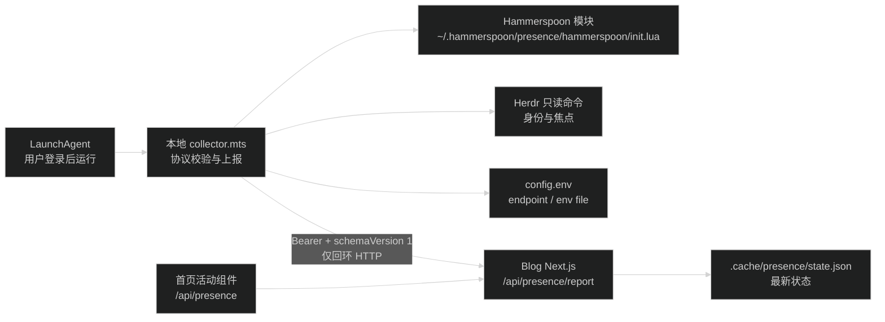

# 本机活动采集器迁移设计

## 1. 目标与边界

本次调整只改变本机采集器的维护位置和进程生命周期，不改变 Blog 的公开页面和活动 API 契约。

- Blog 负责 `src/lib/presence.ts`、`src/lib/presence-store.ts`、两个 API route、首页活动组件和服务端状态校验。
- `/Users/wuwanzhu/.hammerspoon/presence/` 负责桌面采集、Herdr 读取、报告生成、启停命令、测试和 LaunchAgent 安装。
- Blog 不再维护 `presence:*` package script、采集器源码、Hammerspoon 模块或本地启动 wrapper。
- Blog 的 `pnpm dev` 仍由用户手动启动。采集器在 API 未运行时只记录失败并重试，不负责启动或重启 Blog。
- 采集器仍只在当前用户登录会话运行，不改为系统级 `LaunchDaemon`。

## 2. 目录和职责

本机目录由用户维护，不提交到 Blog 仓库：

```text
/Users/wuwanzhu/.hammerspoon/
├── init.lua                         # 保留用户入口，只保留必要的 presence require
└── presence/
    ├── README.md                    # 本机命令、依赖、日志和恢复步骤
    ├── config.env                   # 非密钥配置，权限 600
    ├── collector.mts                # 独立运行的持续采集器
    ├── protocol.mts                 # 本地报告类型、白名单和生成校验
    ├── protocol.test.mts            # 本地报告和采集边界测试
    ├── hammerspoon/
    │   └── init.lua                 # Hammerspoon 应用与锁屏快照模块
    ├── bin/
    │   ├── common.sh                 # 共享路径和 Node 调用
    │   ├── install                 # 迁移文件、生成 plist、bootstrap LaunchAgent
    │   ├── start                   # bootstrap 或 kickstart 服务
    │   ├── stop                    # bootout 服务并写入 hidden 报告
    │   ├── restart                 # stop 后 start
    │   ├── once                    # 一次读取并上报
    │   ├── status                  # 一次读取，只打印不写 API
    │   ├── test                    # 运行本地测试
    │   └── uninstall               # 停止并移除 LaunchAgent，不删除 runtime
    ├── launchd/
    │   └── com.xdd.blog.presence.plist.template
    └── logs/
        ├── collector.out.log
        └── collector.err.log

macOS 注册文件由 `bin/install` 生成，不手工维护：

```text
/Users/wuwanzhu/Library/LaunchAgents/com.xdd.blog.presence.plist
```

`/Users/wuwanzhu/.hammerspoon/presence/` 是源目录；`~/Library/LaunchAgents/` 中的 plist 是 launchd 读取的生成文件。这样 Node 路径或 Blog 根目录变化时只需重新运行本地 `install`。

## 3. 模块边界与依赖方向



依赖规则：

- `protocol.mts` 只处理固定数据和白名单，不读取文件、DOM、环境变量或外部命令。
- `collector.mts` 负责参数模式、配置读取、命令调用、轮询、信号处理和 HTTP 上报，不导入 Blog 的 `src/lib/*`。
- `hammerspoon/init.lua` 只返回 `availability` 和白名单 `desktopApp`，不读取终端内容。
- Blog 的服务器校验继续独立保留；两侧通过 `schemaVersion: 1`、固定字段和 ID 白名单建立协议边界。
- `bin/*` 只负责用户操作和 `launchctl`，不复制采集业务逻辑；持续服务只有 LaunchAgent 一个写入进程。

## 4. 配置和密钥

`config.env` 只保存本机运行参数，不保存 token：

```dotenv
PRESENCE_ENV_FILE=/Users/wuwanzhu/Code/xdd/blog/.env.local
PRESENCE_ENDPOINT=http://127.0.0.1:4400/api/presence/report
HERDR_ENV=1
```

采集器按以下顺序读取配置：

1. LaunchAgent 的 `EnvironmentVariables` 和进程环境。
2. `config.env` 中的 `PRESENCE_ENV_FILE`、`PRESENCE_ENDPOINT`、`HERDR_ENV`。
3. 默认 endpoint `http://127.0.0.1:4400/api/presence/report`。

`PRESENCE_TOKEN` 继续只放 Blog 的 `.env.local`，采集器按 `PRESENCE_ENV_FILE` 读取，不把 token 放进 plist、命令行参数、日志或浏览器。`config.env` 和 `.env.local` 均应为当前用户可读，权限至少检查为 `600`；`PRESENCE_ENDPOINT` 只允许 `127.0.0.1`、`localhost` 或 `[::1]` 的 HTTP 地址。

这样只有一份 token，避免本地配置和 Blog 配置轮换不一致。代价是本机 runtime 仍需要知道 Blog `.env.local` 的绝对路径；迁移 Blog 目录后必须重新运行 `bin/install` 更新配置。

## 5. LaunchAgent

模板生成后的关键字段：

```xml
<key>Label</key>
<string>com.xdd.blog.presence</string>
<key>ProgramArguments</key>
<array>
  <string>/Users/wuwanzhu/.local/share/fnm/node-versions/v26.7.0/installation/bin/node</string>
  <string>--experimental-strip-types</string>
  <string>/Users/wuwanzhu/.hammerspoon/presence/collector.mts</string>
</array>
<key>WorkingDirectory</key>
<string>/Users/wuwanzhu/.hammerspoon/presence</string>
<key>RunAtLoad</key>
<true/>
<key>KeepAlive</key>
<true/>
<key>ThrottleInterval</key>
<integer>5</integer>
<key>ProcessType</key>
<string>Background</string>
```

实际 Node 路径由 `bin/install` 从当前稳定 fnm 版本解析并写入，不使用当前 shell 的 `fnm_multishells` 路径。`PATH` 显式包含：

- `/Users/wuwanzhu/.local/bin`，供 `herdr` 使用。
- `/opt/homebrew/bin`，供 `hs` 使用。
- `/usr/bin:/bin:/usr/sbin:/sbin`，供系统命令使用。

LaunchAgent 的 `RunAtLoad` 表示用户登录后加载，`KeepAlive` 负责采集器意外退出后的重启。它不保证 Blog API 已启动；API 不可用时采集器继续按 2 秒周期重试。服务 stdout/stderr 写入 `logs/`，守护模式不逐轮打印完整 JSON，只记录启动、停止和失败摘要，避免日志无限增长。

Hammerspoon 应用本身由本机现有登录项或 `bin/install` 的一次性 `open -ga Hammerspoon` 保证运行。采集器不能把 Hammerspoon 不可用误判为 active；下一轮读取成功后才恢复报告。

## 6. 命令语义

| 命令 | 行为 | 是否写 API |
| ---- | ---- | ---- |
| `bin/install` | 检查路径和权限，迁移 Hammerspoon 模块，生成 plist，bootstrap 并 kickstart | 否，服务启动后由 daemon 写入 |
| `bin/start` | bootstrap 未加载的 plist，随后 `kickstart -k` | 由 daemon 写入 |
| `bin/stop` | bootout LaunchAgent，调用一次 hidden 清除，停止 Hammerspoon 监听 | 是 |
| `bin/restart` | 执行 stop，再执行 start | 是 |
| `bin/once` | 读取一次并上报，退出 | 是 |
| `bin/status` | 读取一次，打印固定字段，退出 | 否 |
| `bin/test` | 运行本地 `protocol.test.mts`，打印测试结果 | 否 |
| `bin/uninstall` | 执行 stop，移除生成的 plist 和 presence 加载行，保留 runtime | 是，执行 stop 时写入 |

`bin/start` 重复运行必须复用同一个 label，不直接再启动第二个 Node 进程。`bin/stop` 先卸载 KeepAlive 服务，再发送 hidden 报告，避免停止后被 launchd 立即拉起并覆盖 hidden 状态。服务收到 SIGTERM 时也执行相同的 Hammerspoon stop 和 hidden 上报，重复 hidden 写入必须安全。

## 7. 迁移和回滚

迁移顺序：

1. 记录 Blog 当前工作区和本机 Hammerspoon 文件；备份 `~/.hammerspoon/init.lua`、`presence.lua` 和待迁移脚本。
2. 在 `~/.hammerspoon/presence/` 创建独立 TypeScript runtime、Lua 模块、命令 wrapper、配置和日志目录。
3. 将 `/Users/wuwanzhu/.hammerspoon/init.lua` 的加载入口改为 `require("presence.hammerspoon")`，把旧根级 `presence.lua` 移入备份，避免 Lua `require` 优先加载旧文件。
4. 生成 `~/Library/LaunchAgents/com.xdd.blog.presence.plist`，使用固定 Node 路径和显式环境。
5. 先运行 `bin/status`、`bin/test`，再 bootstrap 服务；确认 `launchctl print gui/$(id -u)/com.xdd.blog.presence` 和单个 collector 进程。
6. 启动 Blog `pnpm dev` 后验证 API active、应用切换、Pi 前后台、锁屏/解锁、停止和 TTL。
7. 删除 Blog 的 5 个 `presence:*` package script、`scripts/presence/` 源码和安装说明中的旧命令，README 改为引用本机 `~/.hammerspoon/presence/bin/*`。

回滚只针对本机 runtime：

```bash
/Users/wuwanzhu/.hammerspoon/presence/bin/stop
launchctl bootout "gui/$(id -u)" /Users/wuwanzhu/Library/LaunchAgents/com.xdd.blog.presence.plist
```

然后恢复备份的 Hammerspoon 文件并在 Hammerspoon 菜单重新加载配置。Blog API/UI 不需要回滚；如果本机 runtime 未恢复，服务端会在 TTL 后显示 offline。

## 8. 取舍与风险

- 独立 runtime 不导入 Blog 源码，满足本机维护边界；固定白名单在本地和 Blog 各保留一份，靠 schema version 和接口测试发现漂移。
- 使用 TypeScript 和 Node `--experimental-strip-types` 保留现有语言偏好，同时不引入 npm 依赖或 `pnpm`；Node 版本升级后需要重新运行 `bin/install`。
- 使用用户级 LaunchAgent 而不是 LaunchDaemon，才能访问 Hammerspoon、Herdr 和当前桌面会话；它的自启时点是登录后，不是登录前的系统启动阶段。
- 不自动启动 Blog 开发服务器，避免开发进程、端口和环境变量被本机服务接管；API 未启动时页面继续显示 offline。
- 本机 runtime 不进入 Blog Git 历史，换机器时不能只靠仓库恢复采集器；`~/.hammerspoon/presence/` 需要单独备份。
- launchd 可能因 Node 路径失效或权限错误反复重启；`ThrottleInterval`、stderr 日志和 `launchctl print` 用于定位，不把重启当作活动数据。
