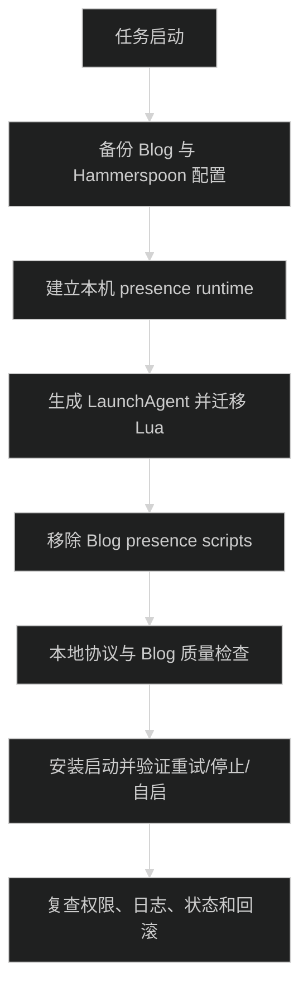

# 实施计划

当前处于 in_progress。按以下顺序实施、验证和更新任务状态；不在本次任务中自动提交 Git。



## 变更边界

- 最小行为差距：当前 Blog 通过 `pnpm presence:*` 运行采集器；目标是由 `~/.hammerspoon/presence/bin/*` 和用户级 LaunchAgent 运行，Blog 只接收活动报告并展示状态。
- 行为实际所在位置：采集逻辑在 `scripts/presence/collector.mts`，桌面事件在 `scripts/presence/hammerspoon/presence.lua`，入口在 `package.json`；服务端协议在 `src/lib/presence.ts` 和两个 API route。
- 预计修改：迁移并改写本机 runtime、`~/.hammerspoon/init.lua`（加载 `presence.hammerspoon`）、生成的 LaunchAgent、`package.json`、README、`.env.example` 和相关 spec；保留 Blog API/UI、`src/lib/presence.ts` 与服务端协议测试。
- 明确不做：不改 Pi、agy、claude 配置或命令入口，不启动 Blog 开发服务器，不引入 npm 依赖，不部署公网，不把本机 runtime 提交到 Blog。
- 行为证明：迁移前后使用相同 schema 和白名单样例运行协议测试；启动 Blog API 后用 `status`、`once`、LaunchAgent 重启、应用切换、停止和 TTL 检查端到端结果。

- [x] 记录当前 Git 状态、开发服务、Hammerspoon 配置和 LaunchAgent 状态；备份 `~/.hammerspoon/init.lua`、旧 `presence.lua`、Blog 的采集脚本和环境文件路径，不读取或打印 token。
- [x] 创建 `/Users/wuwanzhu/.hammerspoon/presence/` 及 `bin/`、`hammerspoon/`、`launchd/`、`logs/` 子目录。
- [x] 将采集协议、七个桌面白名单、Herdr 身份/焦点合并、回环 endpoint 校验、轮询和 hidden 清除迁移为本地 `.mts` 文件；移除对 Blog `src/lib/presence.ts` 和 `pnpm` 的导入依赖。
- [x] 将纯函数测试迁移到本地 `protocol.test.mts`，覆盖白名单、unknown、焦点冲突、敏感字段不进入报告、API 失败重试使用的报告形状和 TTL 相关边界。
- [x] 将 Hammerspoon 模块移动为 `~/.hammerspoon/presence/hammerspoon/init.lua`；只修改根 `init.lua` 的必要 require，旧根模块先备份，确认 Lua 不再加载旧文件。
- [x] 创建 `config.env` 和配置读取逻辑：保存 `PRESENCE_ENV_FILE`、`PRESENCE_ENDPOINT`、`HERDR_ENV`，从 Blog `.env.local` 读取 token；拒绝远程 endpoint，并检查配置权限。
- [x] 编写 `bin/install`、`start`、`stop`、`restart`、`once`、`status`、`test`、`uninstall`；所有命令使用绝对路径或显式 PATH，重复 start 只复用 `com.xdd.blog.presence` 一个服务。
- [x] 生成 `~/Library/LaunchAgents/com.xdd.blog.presence.plist`，设置绝对 Node、工作目录、用户环境、`RunAtLoad`、`KeepAlive`、`ThrottleInterval`、`ProcessType` 和 stdout/stderr 日志路径；plist 不写 token。
- [x] 删除 Blog `package.json` 中 5 个 `presence:*` scripts、`scripts/presence/` 本地 runtime 和安装脚本；保留 API、页面、服务端协议校验和必要测试。
- [x] 更新 README、`.env.example` 和 frontend spec：命令改为 `~/.hammerspoon/presence/bin/*`，写清用户登录自启、Blog 服务手动启动、日志、卸载和 Node 路径更新步骤。
- [x] 运行本地测试和脚本检查：`~/.hammerspoon/presence/bin/test`、`bash -n`、`plutil -lint`；检查 `launchctl print gui/$(id -u)/com.xdd.blog.presence` 和单个采集器进程。
- [x] 运行 Blog 质量门，顺序固定为 `pnpm typecheck`、`pnpm lint`、`pnpm format:check`、`pnpm build`；再启动 Blog 开发服务，验证采集器在 API 不可用时重试、恢复后 5 秒内 active。
- [x] 真实验证 GUI 白名单、Ghostty/Pi 前后台、Herdr unknown、锁屏/解锁、停止、TTL 到期、LaunchAgent kickstart 和用户登录后加载；不读取终端正文或创建 AI 请求。（锁屏/解锁使用未改动的 Hammerspoon 事件模块验证，登录自启通过 `RunAtLoad` 的 bootstrap 验证。）
- [x] 验证 `config.env` 和 `.env.local` 权限、日志无 token、plist 无 token、远程 endpoint 被拒绝、Blog bundle 无本地密钥；完成一次人工跨层复查。

## 验证记录

- Blog 质量门按顺序通过：`pnpm typecheck`、`pnpm lint`、`pnpm format:check`、`pnpm build`。
- 本机协议测试 7 项通过，Blog 服务端协议测试 8 项通过；服务端测试保留 Node 的既有 `MODULE_TYPELESS_PACKAGE_JSON` 性能提示，不影响结果。
- `status` 可从 `/tmp` 等非 Blog 工作目录运行；实测 7 个桌面 bundle 映射、Ghostty/Pi 前后台、停止、TTL、非法 endpoint、错误 token、非法 JSON、超大请求和 KeepAlive 重启。
- `bin/uninstall` 已验证会移除 plist 和 presence 加载行；随后重新 `bin/install`，确认 Hammerspoon 新模块已加载且只有一个 collector。
- `trellis-implement` 和 `trellis-check` 因全局缺少 `@earendil-works/pi-server` 无法启动，主会话按相同清单完成实现和检查。
- 联调使用的 Blog `pnpm dev` 已停止；LaunchAgent 保持已安装和运行，Blog API 仍由用户手动启动。


```bash
/Users/wuwanzhu/.hammerspoon/presence/bin/test
/Users/wuwanzhu/.hammerspoon/presence/bin/status
plutil -lint /Users/wuwanzhu/Library/LaunchAgents/com.xdd.blog.presence.plist
launchctl print "gui/$(id -u)/com.xdd.blog.presence"
pnpm typecheck
pnpm lint
pnpm format:check
pnpm build
```

## 回滚点

- 本机文件迁移前保存带时间戳的备份；失败时只恢复 `init.lua`、Lua 模块、plist 和本地 runtime，不覆盖用户迁移期间的其他 Hammerspoon 配置。
- `bin/stop` 必须先卸载 LaunchAgent，再写入 hidden 报告；Blog API/UI 不需要跟随本机 runtime 回滚。
- 删除 Blog runtime 前先确认本地 `status`、`test`、`once` 和 LaunchAgent 均能运行；若本地迁移失败，先从备份恢复 Blog 的旧脚本，再重新设计迁移步骤。
- 本次不自动启动或修改 Blog `pnpm dev`，不改 Pi、agy、claude 配置，不部署公网。
