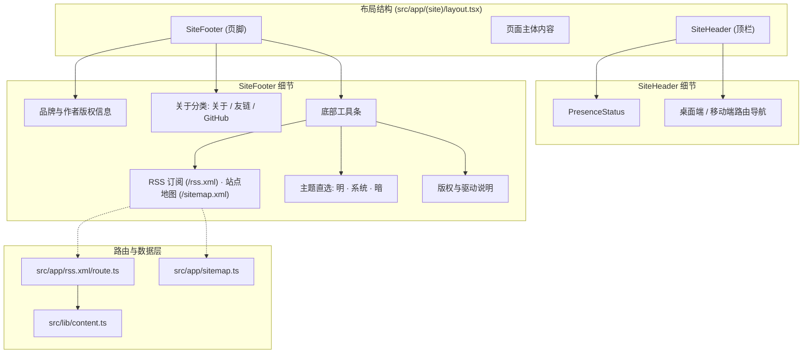
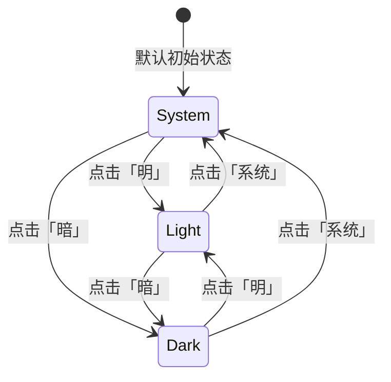

# 技术设计：页脚重构与主题切换迁移

## 1. 架构调整与组件划分

本次改动涉及顶栏组件精简、页脚组件结构升级与新增 RSS 动态生成路由。

## 2. 状态机与主题切换流

主题支持三态切换：`light`（明）、`system`（系统）、`dark`（暗）。

### 实现机制
- **存储与属性**：
  - `document.documentElement.dataset.theme`: `light` | `system` | `dark`。
  - `localStorage.setItem('theme', mode)`。
  - `document.documentElement.classList.toggle('dark', isDark)`。
- **高亮判断**：
  - 组件挂载后，通过读取 `document.documentElement.dataset.theme` 初始化当前激活状态，避免服务端渲染与客户端不同步。
  - 当前激活项应用高亮样式（如 `font-medium text-foreground`），未激活项呈现柔和文本颜色（如 `text-muted-foreground hover:text-foreground`）。

## 3. 页脚双层视觉布局设计

- 容器最大宽度限制为 `max-w-5xl`，与全站主体对齐。
- **上层**：
  - 采用 Flex 布局：宽屏下左侧展示品牌标题与版权，右侧展示关于/外链分类；小屏幕下纵向排列。
- **下层**：
  - 顶部增加细分割线（`border-t border-border/40`）。
  - 工具条左侧集中快捷链接：`RSS 订阅`、`站点地图`。
  - 工具条右侧（或中部）集成文本主题切换器：`明 · 系统 · 暗`，中间通过分隔点 `·` 隔开。
  - 保留清晰的触控热区与无障碍属性（`role="radiogroup"` 或语义化按钮组）。

## 4. RSS 2.0 路由设计

- 路径：`src/app/rss.xml/route.ts`。
- 逻辑：
  1. 调用 `getAllBlogPosts()` 获取所有文章。
  2. 过滤掉 `draft: true` 的草稿。
  3. 按发布日期降序排列。
  4. 组装符合规范的 XML 字符串：
     - `<channel>` 包含站点标题、描述、站点链接、语言（zh-CN）、最后构建时间。
     - 循环 `<item>` 包含文章标题、链接、简述、发布日期（RFC 822 格式）、GUID。
  5. 返回 `new Response(xml, { headers: { 'Content-Type': 'application/xml; charset=utf-8' } })`。
