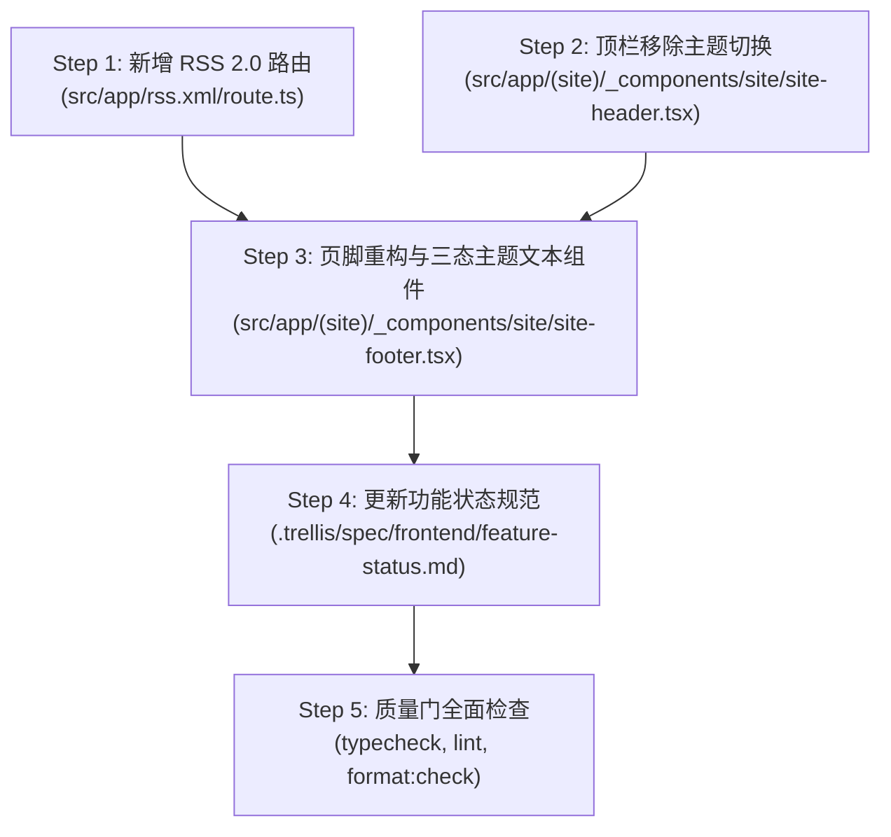

# 执行计划：页脚重构与主题切换迁移

## 1. 任务拆解与执行依赖

## 2. 具体执行步骤

- [x] **Step 1: 动态 RSS 路由**
  - 新建 `src/app/rss.xml/route.ts`。
  - 读取 `getAllBlogPosts()`，生成合规 RSS 2.0 XML。
  - 修改 `src/app/layout.tsx`，在 `metadata.alternates.types` 中声明 `application/rss+xml: '/rss.xml'`。

- [x] **Step 2: 顶栏精简**
  - 在 `src/app/(site)/_components/site/site-header.tsx` 中移除 `ThemeToggle` 导入与引用。
  - 调整桌面端和移动端元素间距，保持布局轻量均衡。

- [x] **Step 3: 页脚双层重构与三态主题控件**
  - 重写 `src/app/(site)/_components/site/site-footer.tsx`：
    - 上层：左侧展示品牌标题与版权说明；右侧展示关于与外链分类导航（移除长句描述与冗余内容导航）。
    - 下层：分割线、左侧工具链接（`RSS 订阅`、`站点地图`）、右侧三态直选文本按钮（`明 · 系统 · 暗`）。
  - 实现文本三态切换逻辑，确保当前模式高亮显示、点击直切、支持系统偏好响应。

- [x] **Step 4: 文档与状态更新**
  - 更新 `.trellis/spec/frontend/feature-status.md`：
    - 将 RSS 标记为“已实现”。
    - 更新三态主题切换位置说明为页脚。

- [x] **Step 5: 质量门三项检查**
  - 运行 `pnpm typecheck`
  - 运行 `pnpm lint`
  - 运行 `pnpm format:check`

## 3. 风险与回滚方案
- 如 RSS 生成数据解析异常，检查 `lib/content.ts` 数据字段（`slug`, `title`, `summary`, `date`）。
- 如主题切换在客户端首屏渲染闪烁，确保 `data-theme` 属性匹配初始脚本并在客户端挂载后安全同步状态。
