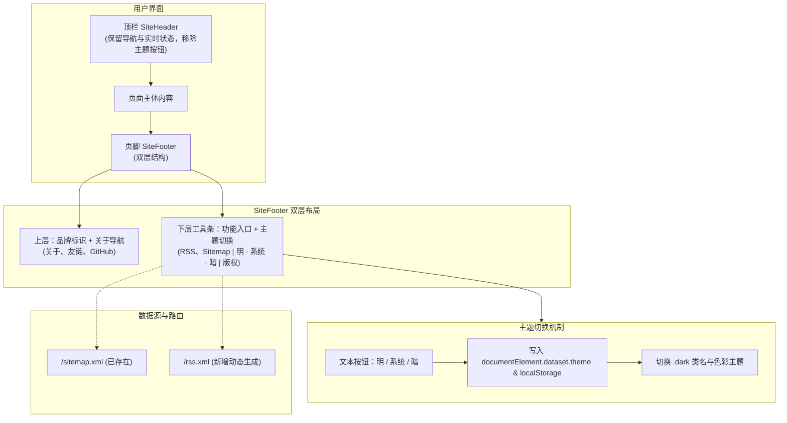

# 优化页脚 UI 与迁移明暗主题切换

## 目标

参考 innei.in 底部设计，重构博客页脚的信息架构与视觉排版：
1. 顶栏完全移除明暗切换按钮，仅保留导航与实时状态，降低视觉负载。
2. 页脚重构为双层布局：上层呈现品牌描述与多列分类导航，下层工具条提供 RSS、站点地图及「明 · 系统 · 暗」三态文本直选切换。
3. 新增基础 RSS 2.0 订阅源输出，使页脚 RSS 链接有效可用。

## 现状与分析

1. **参考站点 (innei.in) 底部结构**：
   - 上层：品牌标识、简短标语、多列分类链接（关于、项目、联系等）。
   - 下层工具条：功能链接（RSS、站点地图、订阅）、文本三态主题切换、备案号。
2. **当前项目代码现状**：
   - 顶栏 `src/app/(site)/_components/site/site-header.tsx` 挂载了 `ThemeToggle`。
   - 页脚 `src/app/(site)/_components/site/site-footer.tsx` 仅居中显示单行版权和 GitHub 链接，缺少层级与信息收拢。
   - 站点地图已由 `src/app/sitemap.ts` 实现（访问路径 `/sitemap.xml`）。
   - RSS 尚未生成，需要在 `src/app/rss.xml/route.ts` 新增。

## 架构与数据流

## 需求说明

### 1. 顶栏调整
- 从 `src/app/(site)/_components/site/site-header.tsx` 中彻底移除 `ThemeToggle`。
- 调整桌面端和移动端导航容器的间距与布局，保证在移除图标后对齐工整。

### 2. 页脚双层结构重构
- **上层区域**：
  - 左侧：站点标题（`siteConfig.title`）、版权声明与 Next.js 驱动标识（不显示长句描述，保持克制干净）。
  - 右侧：关于与社交链接导航：关于我 (`/about`)、友链 (`/links`)、GitHub 外链（移除冗余的内容类重复导航）。
- **下层工具条区域**：
  - 分隔线：细边框与主内容区隔离。
  - 功能入口：`RSS 订阅` (`/rss.xml`)、`站点地图` (`/sitemap.xml`)。
  - 主题直选：`明 · 系统 · 暗` 文本直选按钮组，当前主题对应项高亮加粗，点击直接切换至对应模式，支持跟随系统。
  - 响应式处理：宽屏左右对齐分列；移动端自然折行，按钮保留良好点击热区。

### 3. RSS 2.0 基础输出
- 新增 `src/app/rss.xml/route.ts`。
- 读取非草稿文章列表，生成符合标准的 RSS 2.0 XML。
- 设置正确响应头 `Content-Type: application/xml; charset=utf-8`。
- 在根布局 `src/app/layout.tsx` 的 metadata alternates 中注册 rss 链接。

### 4. 范围界定
- **In Scope**：
  - 顶栏移除主题切换按钮。
  - 页脚双层 UI 重构与三态文本主题切换组件实现。
  - 新增 `/rss.xml` 路由并联动现有文章数据。
  - 更新 `.trellis/spec/frontend/feature-status.md` 功能状态。
- **Out of Scope**：
  - 复杂的外部 Newsletter 邮件投递服务。
  - 语言切换下拉框（当前为中文单语博客）。
  - 背景动效开关。

## 验收标准

- [x] 顶栏不再出现主题切换图标，导航视觉干净。
- [x] 页脚呈现双层结构，信息分组清晰，移动端自适应良好。
- [x] 底栏「明 · 系统 · 暗」文本切换工作正常，当前选中项高亮，刷新后保持状态无闪烁。
- [x] 访问 `/rss.xml` 可正确获取有效的 RSS 2.0 XML 文本。
- [x] 点击底栏「RSS 订阅」和「站点地图」可分别正确打开对应链接。
- [x] 代码质量门检查全部通过：`pnpm typecheck`、`pnpm lint`、`pnpm format:check`。

