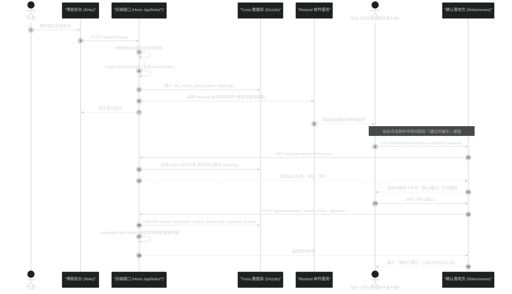

# 友链邮件一键审批技术方案 (design.md)

## 1. 架构与交互时序



---

## 2. 数据库表设计 (Drizzle Schema)

新建文件：`src/server/infra/db/schema/links.ts`，导出至 `src/server/infra/db/schema/index.ts`。

遵守项目规范：表名 snake_case 并带模块前缀 `site_friend_links`，时间戳采用毫秒级整数 `integer({ mode: 'timestamp_ms' })`。

```ts
import { integer, sqliteTable, text } from 'drizzle-orm/sqlite-core'

export const friendLinks = sqliteTable('site_friend_links', {
  id: integer('id').primaryKey({ autoIncrement: true }),
  name: text('name').notNull(),
  url: text('url').notNull(),
  description: text('description').notNull(),
  avatarUrl: text('avatar_url'),
  ownerName: text('owner_name').notNull(),
  email: text('email').notNull(),
  hasAddedUs: integer('has_added_us').notNull().default(0),
  // 审批状态：pending（待审核）| approved（已通过）| rejected（已拒绝）
  status: text('status').notNull().default('pending'),
  // 一次性审批令牌与有效期
  reviewToken: text('review_token'),
  tokenExpiresAt: integer('token_expires_at', { mode: 'timestamp_ms' }),
  // 排序权重：数字越大越靠前
  sortOrder: integer('sort_order').notNull().default(0),
  // 异常/掉链标记：0 正常，1 失效
  isBroken: integer('is_broken').notNull().default(0),
  createdAt: integer('created_at', { mode: 'timestamp_ms' }).notNull(),
  updatedAt: integer('updated_at', { mode: 'timestamp_ms' }).notNull(),
})

export type FriendLinkRecord = typeof friendLinks.$inferSelect
export type NewFriendLinkRecord = typeof friendLinks.$inferInsert
```

---

## 3. 邮件模板样式优化 (解决按钮间距问题)

### 3.1 邮件客户端间距失效原因
现有代码使用 `display: flex; gap: 12px;` 布局按钮。绝大多数邮件客户端（包括各大手机系统自带邮件、桌面版 Outlook、部分网页邮箱）会对 CSS Flexbox 属性直接过滤或降级为流式内联元素，导致多个 `<a>` 标签紧密粘连在一起，不仅破坏视觉美观，在触屏设备上也很容易误触。

### 3.2 表格嵌套方案
在 HTML 邮件规范中，最稳妥、跨客户端兼容度最高的方式是使用**无边框嵌套表格**或**内联块与明确单元格内边距**：

```html
<!-- 审批操作区：采用跨客户端兼容的双单元格表格布局 -->
<table role="presentation" border="0" cellpadding="0" cellspacing="0" style="margin-top: 24px; padding-top: 20px; border-top: 1px solid #f0f0ed; width: 100%;">
  <tr>
    <td style="vertical-align: middle;">
      <!-- 按钮 1：通过并展示 -->
      <table role="presentation" border="0" cellpadding="0" cellspacing="0" style="display: inline-table; vertical-align: middle;">
        <tr>
          <td align="center" style="border-radius: 6px; background-color: #16a34a;">
            <a href="${approveUrl}" target="_blank" rel="noopener noreferrer"
               style="display: inline-block; padding: 10px 20px; font-family: -apple-system, BlinkMacSystemFont, 'Segoe UI', Roboto, sans-serif; font-size: 13px; font-weight: 600; color: #ffffff; text-decoration: none; border-radius: 6px; letter-spacing: 0.02em;">
              通过并展示
            </a>
          </td>
        </tr>
      </table>

      <!-- 明确的间距缓冲单元格，宽度固定为 14px，防止任何客户端粘连 -->
      <span style="display: inline-block; width: 14px; height: 1px;"></span>

      <!-- 按钮 2：婉拒申请 -->
      <table role="presentation" border="0" cellpadding="0" cellspacing="0" style="display: inline-table; vertical-align: middle;">
        <tr>
          <td align="center" style="border-radius: 6px; background-color: #f4f4f5; border: 1px solid #e4e4e7;">
            <a href="${rejectUrl}" target="_blank" rel="noopener noreferrer"
               style="display: inline-block; padding: 10px 18px; font-family: -apple-system, BlinkMacSystemFont, 'Segoe UI', Roboto, sans-serif; font-size: 13px; font-weight: 500; color: #52525b; text-decoration: none; border-radius: 6px;">
              婉拒申请
            </a>
          </td>
        </tr>
      </table>

      <span style="display: inline-block; width: 14px; height: 1px;"></span>

      <!-- 按钮 3：访问小站 -->
      <table role="presentation" border="0" cellpadding="0" cellspacing="0" style="display: inline-table; vertical-align: middle;">
        <tr>
          <td align="center" style="border-radius: 6px; background-color: #18181b;">
            <a href="${safeSiteUrl}" target="_blank" rel="noopener noreferrer"
               style="display: inline-block; padding: 10px 16px; font-family: ui-monospace, Menlo, monospace; font-size: 12px; font-weight: 500; color: #fafafa; text-decoration: none; border-radius: 6px;">
              访问小站 ↗
            </a>
          </td>
        </tr>
      </table>
    </td>
  </tr>
</table>
```

此结构确保在任何极端邮件渲染引擎下，各个按钮之间都严格保留固定间距。

---

## 4. 防预爬与确认落地页设计

### 4.1 为什么必须设计确认落地页
为了保障安全，邮件内链接不直接触发写操作（GET 请求不修改状态）。
链接形态：`${siteConfig.url}/links/review?token=${token}&action=approve`

### 4.2 落地页行为 (`src/app/(site)/links/review/page.tsx`)
1. **未带有效 Token 或 Token 过期**：显示“该审批链接已处理或已失效”。
2. **有效 Token**：
   - 展示申请者的站点名、头像、URL、称呼、简介卡片。
   - 提供明确的确认操作栏：“当前预选操作：通过上线”。
   - 用户点击「确认执行」按钮，向 `/api/links/review` 发送 `POST` 请求。
   - 成功后状态更新，并提供按钮直接跳转到 `/links` 查看最新上线状态。

---

## 5. API 契约设计

### 5.1 `GET /api/links/review`
- **入参**：Query 参数 `token`
- **响应**：
  ```json
  {
    "success": true,
    "data": {
      "id": 1,
      "siteName": "示例小站",
      "siteUrl": "https://example.com",
      "description": "技术与生活随笔",
      "avatarUrl": "https://example.com/avatar.png",
      "nickname": "张三",
      "email": "zhangsan@example.com",
      "status": "pending"
    }
  }
  ```

### 5.2 `POST /api/links/review`
- **请求体**：
  ```json
  {
    "token": "49542a37-b6e8-466d-88fc-8f78a73507fb",
    "action": "approve" // 或 "reject"
  }
  ```
- **业务逻辑**：
  1. 查询 `reviewToken === token` 的记录。
  2. 判断记录是否存在、是否处于 `pending`、是否未过期（`tokenExpiresAt > now`）。
  3. 若验证不通过，返回 400 带有明确错误说明。
  4. 若为 `approve`，更新 `status = 'approved'`，清空 `reviewToken` 与 `tokenExpiresAt`，执行 `revalidatePath('/links')`。
  5. 若为 `reject`，更新 `status = 'rejected'`，清空 `reviewToken`。
  6. 返回 `{ success: true, message: "审核已通过，该友链已展示在小站上" }`。

---

## 6. 前台展示层改造 (`src/app/(site)/links/page.tsx`)

页面从纯前端静态空数组改为服务端组件异步读取数据库：
```ts
const links = await db.query.friendLinks.findMany({
  where: eq(friendLinks.status, 'approved'),
  orderBy: [desc(friendLinks.sortOrder), desc(friendLinks.createdAt)],
})
```
若数据库连接未配置或表为空，自动回退到现有友好的“当前暂无友链”占位状态。
