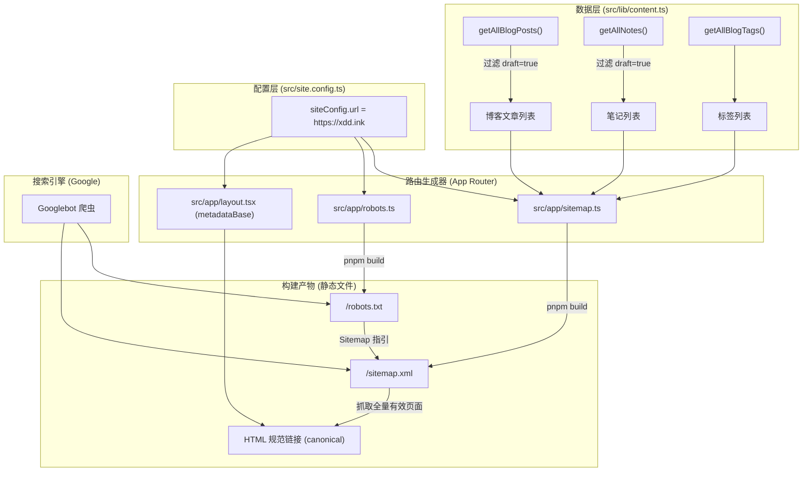

# 站点地图与 SEO 爬虫配置技术设计

## 架构与数据流

本方案基于 Next.js 16 App Router 原生 MetadataRoute 规范构建，在编译阶段将内容源和路由定义转换为静态的 `/sitemap.xml` 与 `/robots.txt`。

## 变更模块设计

### 1. 基础配置修正 (`src/site.config.ts` 与 `src/app/layout.tsx`)

- `src/site.config.ts`：将 `url` 属性由 `https://blog.xdd.ink` 改为 `https://xdd.ink`。
- `src/app/layout.tsx`：为根 `metadata` 注入 `metadataBase: new URL(siteConfig.url)` 与 `alternates: { canonical: './' }`。
  - 作用：使 Next.js 能够正确解析相对路径的 canonical URL 与 OpenGraph 图标路径，确保搜索引擎索引地址规范。

### 2. 站点地图生成器 (`src/app/sitemap.ts`)

- 导出默认函数 `export default function sitemap(): MetadataRoute.Sitemap`。
- 静态路由集合：
  - `/`（优先级 1.0，更新频率 daily）
  - `/blog`（优先级 0.8，更新频率 daily）
  - `/notes`（优先级 0.8，更新频率 daily）
  - `/blog/archives`（优先级 0.7，更新频率 weekly）
  - `/blog/tags`（优先级 0.7，更新频率 weekly）
  - `/projects`（优先级 0.6，更新频率 monthly）
  - `/about`（优先级 0.5，更新频率 monthly）
  - `/links`（优先级 0.4，更新频率 monthly）
  - `/contact`（优先级 0.4，更新频率 monthly）
- 动态内容路由集合：
  - 文章：通过 `getAllBlogPosts()`，严格排除 `post.draft === true`。`lastModified` 取 `new Date(post.updatedDate || post.date)`，优先级 0.8。
  - 笔记：通过 `getAllNotes()`，严格排除 `note.draft === true`。`lastModified` 取 `new Date(note.date)`，优先级 0.6。
  - 标签：通过 `getAllBlogTags()`，路径经 `encodeURIComponent(tag)` 转义，优先级 0.5。

### 3. 爬虫规则定义 (`src/app/robots.ts`)

- 导出默认函数 `export default function robots(): MetadataRoute.Robots`。
- 规则内容：
  - `userAgent: '*'`
  - `allow: '/'`
  - `disallow: ['/api/', '/search']`（`/api/` 为内部活动采集接口；`/search` 目前为客户端占位页，防止爬虫收录空状态）
  - `sitemap: '${siteConfig.url}/sitemap.xml'`

## 兼容性与边界处理

1. **草稿文章泄漏**：本地或调试时部分 MDX 文章 `draft: true` 仍可通过 URL 访问，但严禁进入 Sitemap，必须通过 `.filter((item) => !item.draft)` 显式剔除。
2. **日期格式转换**：`post.date` 和 `post.updatedDate` 在数据层为 ISO 字符串（如 `2026-06-15`），传入 `new Date()` 可以安全转换为有效的 `Date` 实例，满足 Next.js 对 `lastModified` 的类型要求。
3. **中文标签转义**：中文标签（如 `随想`）必须用 `encodeURIComponent` 转义为合法 URL 路径，以防 XML 生成解析异常。
