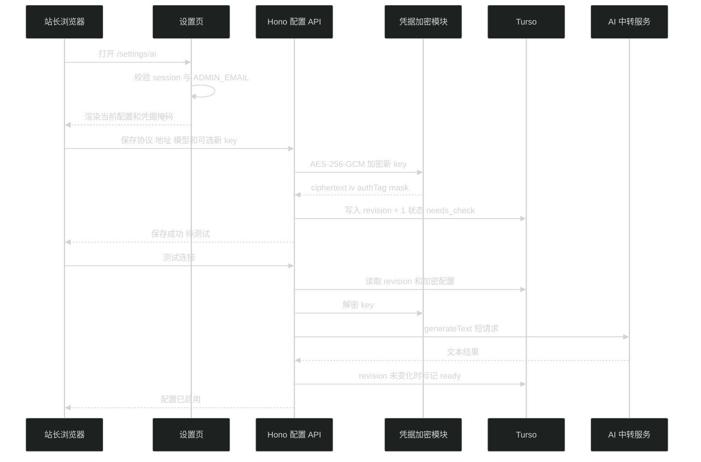

# AI 摘要模型配置技术设计

## 1. 页面与模块

设置页路径为 `/settings/ai`，不进入公开导航。服务端页面先读取 Better Auth session 并校验 `ADMIN_EMAIL`；未登录或非站长统一返回 404。站长登录后，评论区账号栏显示一个带 tooltip 的设置图标作为入口。

模块位置：

- `src/server/infra/ai/credential-crypto.ts`：AES-256-GCM 与掩码。
- `src/server/infra/ai/summary-model.ts`：三协议 model factory、受限 fetch 与安全错误分类。
- `src/server/services/ai-summary-config.ts`：单配置状态、版本和连接测试。
- `src/server/routes/ai.ts`：站长管理端点。
- `src/app/(site)/settings/ai/`：服务端权限边界与客户端表单。
- `src/app/(site)/_components/settings/ai-summary-settings-form.tsx`：设置交互。

## 2. 数据结构

表 `site_ai_summary_config` 只允许固定主键 `default`：

- `protocol`、`base_url`、`model_id`。
- `credential_ciphertext`、`credential_iv`、`credential_auth_tag`、`credential_mask`。
- `status`: `needs_check | ready`。
- `revision`：每次影响调用的配置变更递增。
- `checked_at`、`created_at`、`updated_at`。

API key 不单独保存哈希，因为调用上游必须恢复明文；数据库只存 AES-256-GCM 密文。`AI_CREDENTIAL_ENCRYPTION_KEY` 是 32 字节 base64 主密钥，缺失时应用仍可启动和读取公开页面，但保存、清除、测试和摘要同步返回配置不可用。

## 3. 协议适配

- `openai-completions`：`createOpenAI({ baseURL, apiKey, fetch }).chat(modelId)`。
- `openai-responses`：`createOpenAI({ baseURL, apiKey, fetch }).responses(modelId)`。
- `anthropic-messages`：`createAnthropic({ baseURL, apiKey, fetch }).messages(modelId)`。

连接测试统一使用 `generateText`，`maxRetries: 0`、总超时 20 秒、关闭 telemetry，只接受非空文本且 `finishReason === 'stop'`。测试 prompt 固定为短句，不接受浏览器传入。

## 4. URL 与凭据安全

保存时拒绝非 HTTP(S)、用户名密码、query、fragment 和空 host。调用时使用统一受限 fetch：

- 生产环境解析 host 并拒绝 loopback、私网、link-local、保留地址和 metadata 地址。
- 设置 `redirect: 'manual'`，任何 3xx 都按上游错误处理。
- 限制总超时和错误响应读取长度。
- 不把 AI SDK 的 `requestBodyValues`、`responseBody`、原始 message 或 cause写入日志和响应。

连接测试成功更新状态时必须带 `revision` 条件。测试期间如果用户又保存了配置，旧结果不能启用新版本。

## 5. API 合约

- `GET /api/ai/summary-config`：站长读取配置、状态、掩码和时间，不含加密字段。
- `PUT /api/ai/summary-config`：保存协议、Base URL、模型 ID 和可选 API key，返回 `needs_check`。
- `POST /api/ai/summary-config/check`：测试当前版本；成功后自动标为 `ready`。
- `DELETE /api/ai/summary-config/credential`：二次确认后清除凭据并标为 `needs_check`。

所有端点先校验 session，再校验站长；不存在“知道 URL 就能调用”的管理路径。

## 6. 设置页设计

页面采用 Operate 模式和现有出版物视觉。顶部是 `// PRIVATE SETTINGS` 等宽眉标、衬线标题“AI 摘要配置”和当前状态。主体是一个不嵌套卡片的表单区域：

- 协议使用三段单选控件，标签为“Chat Completions / Responses / Anthropic”。
- Base URL、模型 ID 使用标准文本输入。
- API key 使用密码输入；已有凭据时显示独立掩码状态，空输入明确表示保留当前 key。
- 底部固定动作层级：“保存配置”为主操作，“测试并启用”为次操作；表单有未保存改动时禁用测试。
- 清除凭据使用垃圾桶图标按钮与原生确认 dialog，不与保存按钮并列争夺注意力。

状态提示只说明当前事实：未配置、待测试、可用于摘要同步、测试失败、主密钥缺失。保存和测试结果放入 `aria-live`。输入错误紧邻字段显示；不用 toast 承担唯一反馈。

桌面表单保持单列、最大阅读宽度约 48rem；移动端协议控件改为三行 radio list，操作按钮保持完整可见。页面不展示 provider 目录、额度、token 用量或调用历史。

## 7. 回滚

页面和 API 可以独立下线，配置表保留。主密钥轮换不在首版范围；如果主密钥丢失，旧凭据无法恢复，站长必须清除并重新填写，系统不能改用环境变量中的 provider key。
