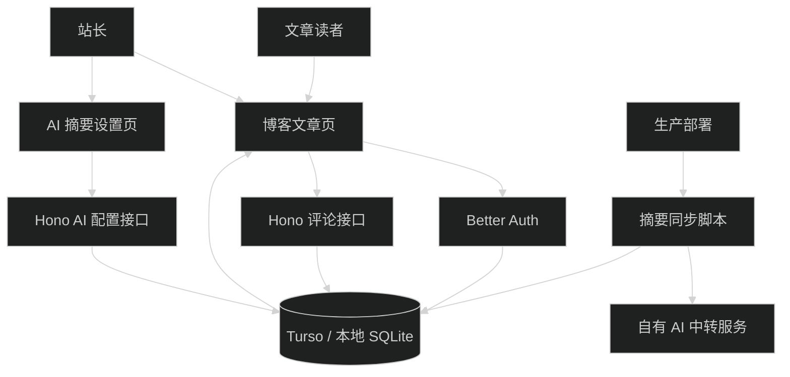

# 社交评论与 AI 自动摘要总体设计

## 1. 边界与实施顺序

本项目保持 Next.js 单应用结构，不新增独立后台或 API 服务。公开页面、站长设置页、Hono API、Drizzle 数据和部署脚本继续在同一仓库维护。

实施顺序：

1. `09-09-social-comments`：先建立 Better Auth、站长身份和评论功能。
2. `09-09-ai-summary-settings`：复用站长身份，实现加密配置与三协议测试。
3. `09-09-ai-summary-sync-display`：读取已启用配置，生成摘要并接入文章页和部署。
4. 父任务执行文章页、数据库、认证和部署的整体检查。

## 2. 状态归属

- MDX：文章正文、`commentKey`、`disableAiSummary`。
- Better Auth 表：用户、账号、session 与 OAuth token。
- 评论表：评论树、置顶、软删除和邮件删除凭证。
- AI 配置表：单条摘要配置、加密凭据、测试状态和版本。
- AI 摘要表：正文哈希、摘要、实际协议和模型。
- 环境变量：OAuth secret、Better Auth secret、站长邮箱、Resend 配置和 AI 凭据加密主密钥。
- 浏览器状态：评论排序、回复目标、表单内容和设置页编辑状态；不保存业务事实。

## 3. 共同安全边界

- 浏览器不能指定用户 ID、站长状态、provider 来源或摘要配置启用状态。
- Hono 每次写操作重新读取 Better Auth session；站长接口再按 `ADMIN_EMAIL` 校验。
- OAuth token 和 AI API key 不进入页面 props、客户端缓存、接口响应或日志。
- AI Base URL 由服务端验证，并通过受限 fetch 拒绝生产环境私网目标与重定向。
- 评论和摘要都允许外部服务失败；文章正文仍可发布和阅读。

## 4. 页面组合

文章详情页按以下顺序渲染：文章标题与元数据、有效 AI 摘要、正文、版权信息、评论区。AI 摘要和评论各自失败时只隐藏或显示本区域错误，不改变正文。

评论区属于 Read 页面中的交互区，保持正文优先；AI 设置页属于 Operate 页面，使用紧凑表单和明确状态，不做独立后台导航。

## 5. 迁移与回滚

- 数据库迁移先新增表，不改写现有友链或 system 表。
- Giscus 只在自建评论端到端验证完成后删除。
- AI 同步在部署中采用失败开放；移除部署同步步骤即可停止生成，缓存表可保留。
- 回滚 AI 设置页时保留凭据表和加密字段，避免历史密文被旧代码误读或泄漏。
