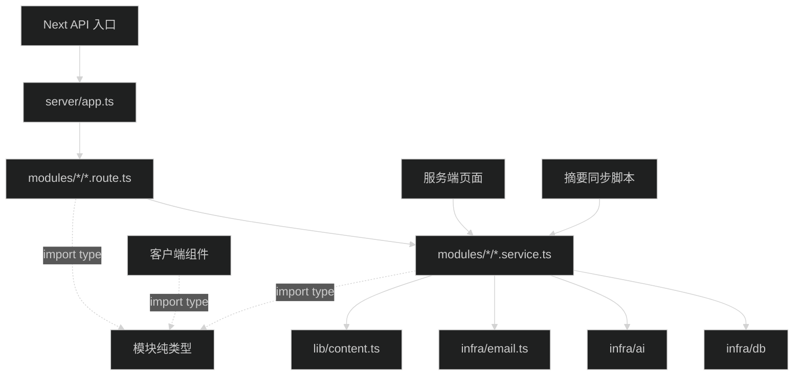

# 服务端模块整理设计

## 结论与边界

采用 `src/server/modules/<业务模块>/`，每个模块内部区分 route、service 和必要的类型文件。保留单包 Next.js + Hono，不拆独立后端，不建立全局 controller、repository、presenter 或 DI 容器。

这不是只搬路由文件：同时把页面内的数据访问交给对应 service，把邮件实现移入 server。页面布局、数据库表、部署方式和业务功能不属于本次变更。

本文件描述目标结构，尚未实施。现状证据见 [current-structure.md](research/current-structure.md)。

## 为什么按模块

现在修改评论功能要在 `routes/`、`services/`、`auth/` 和页面之间跳转；友链还没有 service。按模块放置后，维护一个业务时先进入一个目录，再按文件后缀找职责。

不采用两种做法：

- 只把 `routes/comments.ts` 改成 `routes/comments/index.ts`：文件换了位置，业务代码仍分散在全局层目录。
- 给每个模块补齐 route/service/repository/presenter/schema 五层：当前 Drizzle 查询可以直接放 service，额外转发文件没有实际作用。

目录表示业务归属，不等同于 URL 前缀。当前七组 URL 归为六个模块：`config/auth` 属于认证，不单设 config 模块。

## 目标目录

```text
src/server/
├── app.ts
├── modules/
│   ├── auth/
│   │   ├── auth.route.ts
│   │   ├── auth-config.route.ts
│   │   ├── auth.service.ts
│   │   ├── auth.config.ts
│   │   └── auth.test.ts
│   ├── comments/
│   │   ├── comments.route.ts
│   │   ├── comments.service.ts
│   │   ├── comments.types.ts
│   │   ├── comments.route.test.ts
│   │   └── comments.service.test.ts
│   ├── links/
│   │   ├── links.route.ts
│   │   ├── links.service.ts
│   │   ├── links.types.ts
│   │   ├── links.rate-limit.ts
│   │   ├── links.route.test.ts
│   │   └── links.service.test.ts
│   ├── ai/
│   │   ├── summary-config.route.ts
│   │   ├── summary-config.service.ts
│   │   ├── summary.service.ts
│   │   ├── ai.types.ts
│   │   ├── summary-config.route.test.ts
│   │   ├── summary-config.service.test.ts
│   │   └── summary.service.test.ts
│   ├── presence/
│   │   ├── presence.route.ts
│   │   ├── presence.service.ts
│   │   └── presence.test.ts
│   └── system/
│       ├── system.route.ts
│       ├── system.service.ts
│       └── system.test.ts
├── infra/
│   ├── db/
│   │   ├── client.ts
│   │   ├── schema/
│   │   └── migrations/
│   ├── ai/
│   │   ├── types.ts
│   │   ├── summary-model.ts
│   │   ├── credential-crypto.ts
│   │   └── 原有基础设施测试
│   └── email.ts
└── shared/
    └── response.ts
```

- 不再保留全局 `routes/`、`services/`、`auth/`。
- 不给模块增加只负责转发的 `index.ts`。调用方直接导入 `*.service.ts` 或 `*.types.ts`。
- 同域多个端点放同一个 route 文件，不为每个 HTTP 方法再建目录。
- 只有真实存在的职责才建文件。`links.rate-limit.ts` 存放已有的进程内频控；其他模块不创建空的限流文件。
- `infra/db/schema/` 与迁移目录不动。模块划分不要求数据库表定义也随之移动。
- `src/lib/content.ts`、`src/lib/presence.ts`、`src/lib/ai-summary.ts` 和 `src/lib/auth-client.ts` 不移动：分别仍负责 MDX、公开活动协议、正文哈希和客户端认证。

## 路由归属与组装

| 完整端点                                                                                                                                                | 目标文件                             |
| ------------------------------------------------------------------------------------------------------------------------------------------------------- | ------------------------------------ |
| `/api/auth/*`                                                                                                                                           | `modules/auth/auth.route.ts`         |
| `GET /api/config/auth`                                                                                                                                  | `modules/auth/auth-config.route.ts`  |
| `GET/POST /api/comments`、`GET/POST /api/comments/delete`、`PATCH /api/comments/:id/pin`、`DELETE /api/comments/:id`                                    | `modules/comments/comments.route.ts` |
| `POST /api/links/apply`、`GET/POST /api/links/review`                                                                                                   | `modules/links/links.route.ts`       |
| `GET/PUT /api/ai/summary-config`、`POST /api/ai/summary-config/check`、`DELETE /api/ai/summary-config/credential`、`POST /api/ai/summary-config/models` | `modules/ai/summary-config.route.ts` |
| `GET /api/presence`                                                                                                                                     | `modules/presence/presence.route.ts` |
| `GET /api/system/health`、`GET /api/system/db-check`                                                                                                    | `modules/system/system.route.ts`     |

`app.ts` 是唯一组装位置：`createApp()` 返回以 `/api` 为 basePath 的 Hono 链式挂载结果；继续导出应用单例，`AppType` 直接从该结果推导。删除 `routes/index.ts` 和 `apiRoutes` 出口。

模块 route 用链式声明，handler 紧邻路径，避免新建 controller 丢失路径参数推导。`comments/delete` 等静态路径在参数路径之前注册。

`src/app/api/[[...route]]/route.ts` 仍只把请求交给应用。不新增 Next API 入口，不增加另一个 auth 配置 URL。

## 职责规则

| 位置             | 应该处理                                                                                  | 不应该处理                                                        |
| ---------------- | ----------------------------------------------------------------------------------------- | ----------------------------------------------------------------- |
| `app.ts`         | Hono basePath、模块挂载、应用类型                                                         | SQL、业务规则、请求体处理                                         |
| `*.route.ts`     | URL/方法、HTTP 参数和请求体解析、请求形状校验、会话与端点准入、调用 service、响应和缓存头 | SQL、令牌有效期判断、业务状态更新、邮件/模型请求                  |
| `*.service.ts`   | 业务校验、资源权限、数据查询与写入、状态规则、数据组装、外部调用编排和业务错误            | Hono Context、`c.json`、Next `headers()`、`revalidatePath`、React |
| `*.types.ts`     | 调用输入、公开 DTO、排序值等纯类型                                                        | 数据库实例、Hono/SDK 初始化、环境变量读取                         |
| `infra/`         | 数据库连接和 schema、模型驱动与安全请求、凭据加密、邮件发送实现                           | 导入业务模块、决定审核/评论/摘要业务状态                          |
| `shared/`        | 已被多个模块使用的无业务归属工具，如响应封装                                              | 把域内辅助函数改名为通用工具                                      |
| 页面与客户端组件 | 渲染、交互、显示格式、请求结果展示                                                        | 直接查表、解析审核状态规则、调用邮件或模型驱动                    |

补充边界：

- service 可以直接使用 Drizzle，不为单次查询新增 repository。查询真正有独立维护需要时再讨论拆分，不预留空目录。
- 会话解析和站长判定由 auth service 提供。route 可以执行端点级登录/站长准入；资源是否可回复、可置顶、可审核仍由业务 service 判定。客户端不能提交可信用户 ID 或站长标记。
- auth service 的 `getSession(headers: Headers)` 是会话读取边界，接收 Web 标准 Headers；其他业务 service 不接收请求对象。Better Auth 的原始 handler 直接挂在 auth route，不加无意义的转发 service。
- 错误使用模块内的 Error 类。HTTP 状态、响应封装和展示文案由 route 处理；不创建全站错误基类。现有错误的安全消息和状态信息可以随模块结果返回，不导入 Hono 类型到 service。
- AI service 把 `SummaryModelError` 转成模块错误；route 不再 import AI 驱动或凭据实现。非法 Base URL 属于输入错误，连接测试失败属于测试错误，模型列表请求失败属于上游错误；状态信息仍由 route 输出。
- Next 缓存刷新属于 HTTP/页面框架边界。友链审核 service 返回处理结果，route 仅在通过后刷新 `/links`。
- `*.types.ts` 中只有 type-only import；AI 协议与模型条目类型由 `infra/ai/types.ts` 定义一份，模块 DTO 引用这些类型，不从驱动运行时文件取类型。

## 调用方向



图中是常规业务调用，认证有一个明确例外：`auth.route.ts` 直接调用同模块 `auth.config.ts` 创建的 Better Auth handler。

允许的跨模块调用只有真实需要的方向：comments / AI 的 HTTP 准入读取 auth service；comments service 使用站长判定；system service 读取 presence service 的健康探测。业务 service 不导入其他模块的 route，infra 不反向导入 modules。

模块仍共享一套数据库。comments 的作者展示允许联表只读 `user/account`，不因此逐条调用 auth service 产生 N+1 查询；账号和 session 的写入继续由 Better Auth 承担。

## 各模块的实际调整

### auth

- `auth.config.ts` 放 Better Auth 实例、provider 配置、可信来源和 secret 检查。
- `auth.service.ts` 接管原 `session.ts` 的会话、站长判断和 provider 查询，并提供公开认证配置读取。
- `auth-config.route.ts` 只取会话并返回 provider 可用性与 `isOwner`，不读取 OAuth secret。
- OAuth cookie、会话表、`basePath` 和第三方 handler 都由 Better Auth 原本的实现处理，不复制一套。

### comments

- 路由和 service 移入同一目录，客户端用到的 `CommentAuthor`、评论视图、排序类型和结果类型移到 `comments.types.ts`。
- 查询、组树、回复规则、置顶、软删除和邮件令牌仍归 comments service。本次不为这些函数分别补一层 repository 或 presenter。
- 通知改从 `infra/email.ts` 导入，不改正文校验、排序或异步通知策略。

### links

service 提供四个实际业务入口：提交申请、读取审核详情、执行审核、读取公开友链列表。route、公开页面和审核页面都调用它，不各写一份 SQL。

- `links.rate-limit.ts` 管 IP 计数，进程内只创建一个 Map。route 提供 IP 并在解析 JSON 前检查。
- route 解析字段类型和 HTTP 参数；service 处理申请有效性、令牌生成、七天过期、pending 状态、写库与通知。
- 提交输入不含审核令牌；审核令牌由 service 生成，不从浏览器读取。
- service 返回模块数据，不返回 Hono Response 或 Next 缓存操作。
- 审核详情用一份业务读取逻辑。页面根据模块结果或业务错误选择缺凭证、无效、过期、已处理、待审核界面；不再检查数据库字段决定过期。
- 邮件模板和发送实现整体移动，不在本次重新设计模板、发信服务或消息队列。

### ai

- `summary-config.service.ts` 负责配置、凭据、启用检查、模型列表和主密钥可用状态。
- 原摘要服务的 `getReadySummaryConfig` 和对应内部类型移到配置 service；配置读取和解密不再由两个 service 分别拥有。
- `summary.service.ts` 负责文章摘要缓存、生成、文本校验和全站同步，调用配置 service 取 ready 配置。
- 设置页从配置 service 读取主密钥可用状态，不直接 import 加密驱动；这项读取不要求新增数据库查询。
- `AiSummaryConfigDto` 与表单使用的输入类型放 `ai.types.ts`。含解密 API Key 的内部配置类型留在 service，不作为客户端 DTO。
- `infra/ai/` 的安全请求、协议驱动和加密实现不重写，只把纯协议类型移到 `types.ts` 并更新引用。

### presence 与 system

presence service 提供两个语义不同的动作：

- 读取公开活动数据：1500 ms 超时，解析公开协议，失败返回离线对象。
- 探测来源服务健康：800 ms 超时，只判断 HTTP 可用性，供状态页使用。

两者使用同一来源地址读取位置，但不把“HTTP 在线”误当成“活动数据有效”。小型、模块独用的 fetch 留在 service，不再增加一个空的 presence adapter。

system service 提供进程健康、数据库探测和状态页数据聚合。API 与页面共用数据库探测，只在各自输出处转换状态标签；SQL 不留在页面或路由中。状态页的展示格式和 JSX 不变。

## 状态与业务检查

| 状态                 | 所有者                                  | 整理时的检查                                           |
| -------------------- | --------------------------------------- | ------------------------------------------------------ |
| 账号、OAuth、session | Better Auth + `infra/db/schema/auth.ts` | 不新增用户/session 写入入口                            |
| 评论与删除凭证       | comments service                        | GET 预览只读；确认删除清空正文与凭证；回复仍平铺       |
| 友链与审核凭证       | links service                           | 申请先落 pending；通过/拒绝清除凭证；列表只读 approved |
| 友链频控             | links 模块进程内 Map                    | 移动文件后仍按同一进程、同一窗口累计，不改 Redis       |
| AI 配置及 revision   | AI 配置 service                         | 保存后 needs_check；测试成功且 revision 未变才 ready   |
| AI 摘要缓存          | AI 摘要 service                         | 内容哈希相同跳过；生成成功后写库；页面不调用模型       |
| 活动状态             | 外部 Presence Service                   | Blog 只读，离线结果不写成业务数据                      |
| 主密钥与服务凭据     | 环境变量/现有加密字段                   | 不输出到 DTO、日志、测试产物或设计文件                 |

失败行为也只保留一份实际实现：友链邮件失败不撤销已写入的 pending 记录；评论通知失败不撤销评论；活动服务失败显示离线；摘要读取失败不阻止正文；单篇摘要生成失败不覆盖旧缓存。这里没有新增故障处理路径。

## 一次迁移，不做兼容

下表中的“删除”表示调用方已直接切换到新位置，旧文件不留 re-export、别名或转发逻辑。

| 当前位置                                                              | 目标位置或动作                                                           |
| --------------------------------------------------------------------- | ------------------------------------------------------------------------ |
| `src/server/routes/index.ts`                                          | 挂载合入 `src/server/app.ts`，删除旧文件与 `apiRoutes` 导出              |
| `src/server/routes/auth.ts`                                           | `modules/auth/auth.route.ts`，删除原文件                                 |
| `src/server/routes/config.ts`                                         | `modules/auth/auth-config.route.ts`，删除原文件                          |
| `src/server/auth/config.ts`                                           | `modules/auth/auth.config.ts`，删除原文件                                |
| `src/server/auth/session.ts`                                          | `modules/auth/auth.service.ts`，删除原文件                               |
| `src/server/routes/comments.ts`、`src/server/services/comments.ts`    | comments 模块同名角色文件，删除原文件                                    |
| `src/server/routes/links.ts`                                          | links 模块的 route、service、types、rate-limit，删除原文件               |
| `src/server/routes/ai.ts`、`src/server/services/ai-summary-config.ts` | AI 模块 `summary-config` route / service，删除原文件                     |
| `src/server/services/ai-summary.ts`                                   | AI 模块 `summary.service.ts`；ready 配置读取转入配置 service，删除原文件 |
| `src/server/routes/presence.ts`、`src/server/routes/system.ts`        | 对应模块 route / service，删除原文件                                     |
| `src/lib/email.ts`                                                    | `src/server/infra/email.ts`，删除原文件                                  |
| 原 auth、comments、AI 测试                                            | 随所属模块移动，直接更新 import 和 `package.json` 文件列表               |
| `summary-model.ts` 中的纯协议、模型条目类型                           | `infra/ai/types.ts`；调用方直接改 import，旧文件不 re-export             |
| 三个客户端组件的 service 类型引用                                     | 改为模块 `*.types.ts`                                                    |
| 相关页面、同步脚本                                                    | 直接改用模块 service，不通过旧路径过渡                                   |

URL 和响应协议不是这次结构整理的变更项。端点表中的每个地址只有一个直接实现，不加新地址再把旧地址转发过去；不为历史目录添加 tsconfig、package imports 或测试 loader 映射。

只有所有源码引用和测试入口都更新后才交付这次变更。不做逐版本过渡、双写、特性开关或两套目录并存。失败时修正当前变更；若需要撤销源码，先取得用户授权，不在运行时切回旧实现。数据库结构未变，不设计数据迁移或数据回滚。

## 风险与验收重点

- **测试会写库**：现有评论/AI 测试会清理默认库数据，必须使用显式的临时 SQLite 与空外部凭据，详见 [implement.md](implement.md)。
- **默认导入副作用**：服务或纯类型不能通过模块总出口顺带加载 route、完整 app 或 Better Auth。
- **路由顺序与原始响应**：检查静态路径、各方法挂载、Better Auth cookie 和 Response；不能统一套 JSON 包装。
- **状态语义**：presence 数据读取与健康探测分开；友链审核 GET 不能意外写库；AI 页面不能触发生成。
- **跨层遗漏**：页面、客户端 type-only import、CLI、测试显式清单都要检查，不能只移动 `src/server`。
- **现有规范失真**：实施验证后更新 backend 目录、API、service、数据库相关段落和 frontend 的路径记录。规划时不把目标结构写成已实现事实。

不在本次顺手修改的事项：友链审核并发策略、邮件超时与模板内容、OAuth 功能、全站 API 响应格式、状态页既有宣传性文案、模型协议选择、数据库 schema 和迁移历史。
