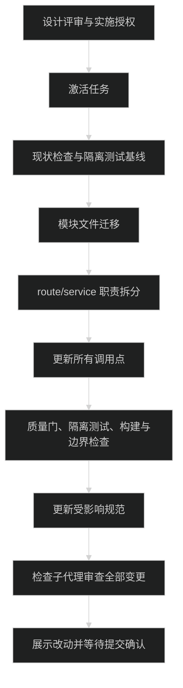

# 服务端整理实施计划

## 当前阶段与开始条件

任务仍为 `planning`。用户已批准调研范围及“不做兼容”，尚未批准本设计进入实施。下面是后续执行顺序，不代表已经修改源码。

- [ ] 用户评审最新 `prd.md`、`design.md` 和本文件，并在后续消息明确批准实施。
- [x] `implement.jsonl`、`check.jsonl` 各有六条实际的规范与调研条目，`task.py validate` 通过。
- [ ] 执行 `python3 ./.trellis/scripts/task.py start .trellis/tasks/09-10-server-module-structure`，状态变为 `in_progress`。

按项目 Trellis 流程派发 implement/check 子代理。此前用户允许的是主会话完成调研与设计，不把这次授权扩展成跳过实施或检查子代理的许可；若子代理再次不可用，停下报告。

## 执行顺序



本任务是一次服务端结构调整，不拆父子任务。中间步骤可分别验证，但不交付只有一半引用迁移完成的目录。

## 1. 记录基线

- [x] 重新读取当前用户消息、任务文件、`git status --short` 和最近提交。
- [x] 按 `trellis-before-dev` 读取 backend/frontend 索引与本任务清单。
- [x] 依次运行 `pnpm typecheck`、`pnpm lint`、`pnpm format:check`，记录已有错误。
- [x] 在临时 SQLite 环境运行原测试，记录通过/失败与原因。
- [x] 记录现有端点、导出、页面调用点，依据 `research/current-structure.md` 逐一核对。

## 2. 移动模块文件

- [x] 按 `design.md` 迁移表移动 auth、comments、AI 的路由、service 和原测试。
- [x] 将 `src/lib/email.ts` 整体移到 `src/server/infra/email.ts`；只改引用，不重写模板、文案和发送行为。
- [x] 创建 comments / AI 的纯类型文件，移出客户端实际需要的 DTO 和输入类型。
- [x] 把 AI 驱动中的协议与模型条目类型移到 `infra/ai/types.ts`，直接修改调用方，不保留旧导出。
- [x] 在 `app.ts` 链式挂载六个模块的七组路由；`auth-config.route.ts` 直接挂在 `/config`。
- [x] 删除原 `routes/index.ts` 与 `apiRoutes`，从新应用推导 `AppType`。
- [x] 模块内部使用清楚的同级 import；跨模块直接引用目标 service 或 types，不增加模块总出口。

## 3. 划分 route 与 service

### links

- [x] 现有进程内频控提到 `links.rate-limit.ts`；保持计数窗口、阈值和请求解析前计数的位置。
- [x] 提交申请、审核详情、审核动作、公开列表查询放入 `links.service.ts`。
- [x] 请求形状解析留在 route；令牌、过期、pending 状态、业务字段约束和数据写入只由 service 处理。
- [x] service 返回模块数据或业务错误，不操作 Hono / Next cache。
- [x] route 在审核通过后刷新 `/links`；拒绝或失败不刷新。刷新异常不能撤销已完成的业务写入。

### auth 与 comments

- [x] 会话与站长判断归 `auth.service.ts`，公开 provider 配置由该 service 返回安全字段。
- [x] Better Auth 原始 handler 直接挂载，不包成 `ApiResponse`，不复制认证实现。
- [x] comments service 使用新邮件位置，保留评论业务规则；客户端类型只从 `comments.types.ts` 导入。
- [x] 不把资源权限判断删掉，也不把用户 ID / 站长布尔值改为由请求体提供。

### ai

- [x] 将 `getReadySummaryConfig` 与内部凭据类型从摘要 service 移到配置 service，更新摘要服务和测试的直接调用。
- [x] 配置 service 处理模型驱动错误，route 不再识别基础设施错误类或 import 加密驱动。
- [x] 设置页的主密钥可用性读取交给配置 service；不因此增加模型或数据库调用。
- [x] 摘要缓存、生成和同步仍使用现有驱动、正文哈希和逐篇处理逻辑。

### presence 与 system

- [x] presence service 分别提供公开数据读取和来源健康探测，区分 1500 ms 与 800 ms 的现有动作。
- [x] route 只输出公开活动对象与 no-store 响应头。
- [x] system service 提供数据库探测、进程健康和状态页数据，删除 route/page 内的重复 SQL。
- [x] 状态页只做格式化与渲染，不直接调用外部活动接口。

## 4. 更新外部调用点

- [x] `src/app/(site)/links/page.tsx`：改调公开列表 service，保留布局与排序展示。
- [x] `src/app/(site)/links/review/page.tsx`：改调审核详情 service，按结果渲染现有状态，不再按 DB 日期字段判断业务有效期。
- [x] `src/app/(site)/status/page.tsx`：改调 system service，保留 JSX、格式化和展示标签。
- [x] `src/app/(site)/settings/ai/page.tsx`：改调 auth / AI service，保留非站长 `notFound()`。
- [x] `src/app/(site)/blog/[slug]/page.tsx`、`scripts/sync-summaries.ts`：更新摘要 service 引用，页面仍只读缓存。
- [x] 两个评论客户端组件和 AI 设置表单改用模块纯类型。
- [x] 确认 `src/lib/auth-client.ts`、MDX 读取层、公开活动协议和正文哈希文件不需要迁移。

## 5. 移动与补充测试

`package.json` 保持现有 Node 测试与显式文件列表，不改成新框架或另建测试入口。下表所有移动及新增文件都需出现在 `pnpm test` 中。

| 原测试或新增范围                                | 目标测试                                                                |
| ----------------------------------------------- | ----------------------------------------------------------------------- |
| `src/server/auth/auth.test.ts`                  | `src/server/modules/auth/auth.test.ts`                                  |
| `src/server/routes/comments.test.ts`            | `src/server/modules/comments/comments.route.test.ts`                    |
| `src/server/services/comments.test.ts`          | `src/server/modules/comments/comments.service.test.ts`                  |
| `src/server/routes/ai.test.ts`                  | `src/server/modules/ai/summary-config.route.test.ts`                    |
| `src/server/services/ai-summary-config.test.ts` | `src/server/modules/ai/summary-config.service.test.ts`                  |
| `src/server/services/ai-summary.test.ts`        | `src/server/modules/ai/summary.service.test.ts`                         |
| 新增友链覆盖                                    | `src/server/modules/links/links.route.test.ts`、`links.service.test.ts` |
| 新增 presence 覆盖                              | `src/server/modules/presence/presence.test.ts`                          |
| 新增 system 覆盖                                | `src/server/modules/system/system.test.ts`                              |
| 不移动                                          | 原 AI 基础设施、公开活动协议、正文哈希测试                              |

- [x] 路由测试使用 Hono `app.request()`，不要求运行 HTTP 服务器。
- [x] 友链覆盖输入失败、每 IP 第四次请求被限流、pending 落库、邮件失败后记录仍在、审核 GET 只读、token 无效/过期、通过/拒绝清除凭证、列表只读 approved。
- [x] presence 覆盖合法数据、非法数据、非 2xx、网络失败、超时、no-store 响应头；健康探测与活动数据解析分别断言。
- [x] system 覆盖 `/health`、数据库成功/失败、状态页聚合。使用临时库或可控替代调用，不探测远程库。
- [x] auth 覆盖公开配置和原始 handler 挂载；评论原有业务断言不能减少。
- [x] AI 配置保留凭据脱敏与 revision 冲突断言，并把 `/summary-config/models` 加入未登录/非站长的权限测试。
- [x] 生成测试继续使用替代 fetch，不发送真实模型请求；邮件测试同样不发送真实邮件。
- [x] 检查 `next/cache` 在现有 loader 中是空实现，不能把它当作缓存刷新已被实测的证据。检查 route 成功分支，并在本地应用验证审核后的友链展示。

## 6. 最后一次完整检查

代码修改后的顺序固定：

```bash
pnpm typecheck
pnpm lint
pnpm format:check
```

前三项通过后，在隔离环境跑 `pnpm test` 与 `pnpm build`。

- [x] 产品代码、测试和脚本中没有 `server/routes`、`server/services`、`server/auth` 或 `@/lib/email` 旧引用。
- [x] 旧目录、旧文件、旧类型导出已删除；没有 re-export 转发、路径别名、重复实现或 loader 特例。
- [x] 业务 route 不导入 DB、schema、AI SDK 或邮件实现；service 不导入 Hono、`next/*` 或 React。Better Auth 原始 handler 是设计中唯一的 route 特例。
- [x] 客户端没有 service 的运行时 import；纯类型文件没有运行时代码。
- [x] 目标页面不直接导入 DB/schema/AI 加密驱动或自行 fetch 活动来源。
- [x] 六个模块没有互相 import route，infra 没有反向 import modules。
- [x] 页面 diff 仅涉及数据获取、类型、import 和对应字段引用，没有布局、样式或文案重写。
- [x] 数据库 schema、迁移历史、依赖版本、部署脚本无变更。
- [x] 本地检查友链列表/审核页、状态页、文章摘要读取和 AI 页面准入；测试只使用本地数据。

## 7. 更新实际规范

实施与检查通过后，使用 `trellis-update-spec` 更新这些已有文档：

- [x] `.trellis/spec/backend/index.md`、`directory-structure.md`、`api-design-guidelines.md`、`service-call-guidelines.md`：模块目录、唯一挂载、HTTP/service 边界、页面调用规则。
- [x] `.trellis/spec/backend/database-guidelines.md`：修正相关现状冲突、调用位置与 AI 配置/摘要服务分工。
- [x] `.trellis/spec/frontend/feature-status.md`：更新受影响功能的文件位置。
- [x] `.trellis/spec/frontend/component-guidelines.md`：邮件路径改为 server infra。
- [x] `AGENTS.md` 与 `README.md`：纠正概况中“整个项目无数据库”的不实描述。

纯文档检查使用 `pnpm format:check`、针对本次 Markdown 的 `pnpm exec prettier --check --ignore-path /dev/null <文件列表>`、相对链接检查和 `git diff --check`。

## 本轮规划检查记录

- `pnpm format:check` 通过。
- 对四份任务 Markdown 和 `task.json` 显式运行 Prettier 检查。初次检查退出码为 1，发现新文件的表格及 JSON 格式问题；只格式化这些新增文件后重跑通过。
- `task.py validate` 通过，两份清单各六条。
- 四份 Markdown 的五个相对链接有效；两段 Mermaid 均指定暗色主题，已用本机 `mmdc` 渲染并检查文字可读性。
- `git diff --check` 及七个新增任务文件的 `git diff --no-index --check` 通过，已跟踪产品文件未改动。
- 没有修改代码，因此本轮未运行类型、Lint、业务测试或构建；没有执行数据库迁移、摘要同步或真实外部调用。
- 最新设计仍需用户评审，没有实施或提交授权。

## 停止与撤销边界

- 未获最新设计批准，不运行 `task.py start`，不修改产品代码。
- 实施发现需要改业务功能、URL、数据库或部署，先停止并更新规划，不自行扩大任务。
- 子代理或项目指定检查失败时报告，不改用未经授权的路径。
- 不用兼容文件修补遗漏引用；直接修正调用方。
- 只在用户授权后撤销本次源码改动，不回滚用户或其他工具的工作。
- 完成后展示准确改动与验证结果。只有用户明确确认提交计划后才执行 commit；不 push。
