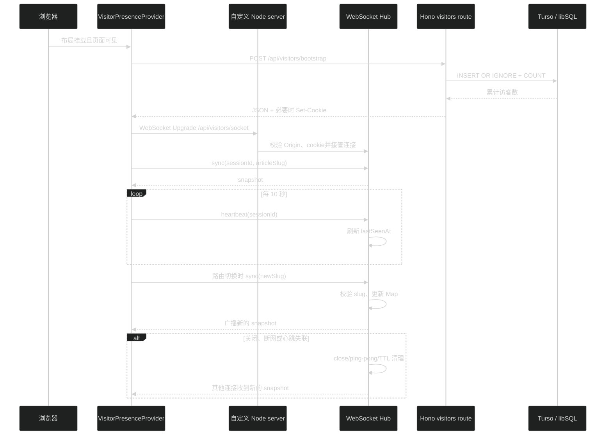
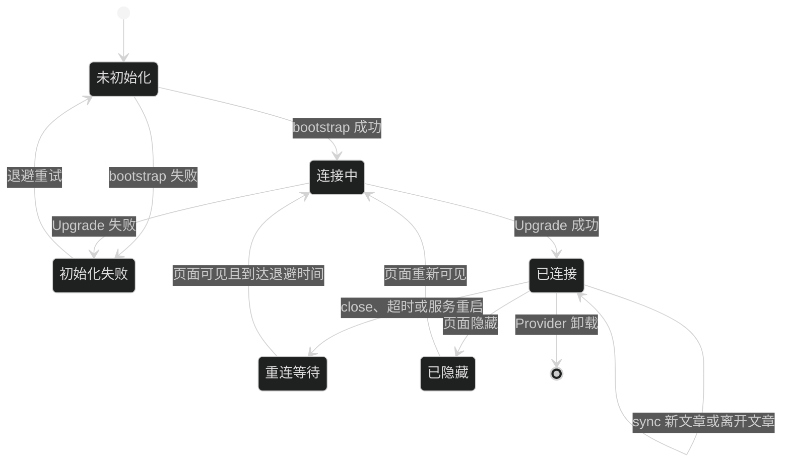

# 技术设计：访客统计与文章实时在线状态

## 1. 设计结论

新增 `visitors` 业务模块，保留现有 Hono + Drizzle 结构；实时连接由仓库根目录的自定义 Node 入口承载。

- 匿名去重访客写入 Turso/libSQL：只保存随机 `visitorId` 和首次访问时间。
- 浏览器先通过同源 HTTP 初始化接口取得 `site_visitor_id` HttpOnly cookie，再建立同源 WebSocket；WebSocket 握手只读取 cookie，不接收客户端提交的访客 ID。
- 当前在线会话保存在 Blog 进程内。用 `visitorId` 去重在线人数，用 `sessionId` 区分标签页，用 `connectionId` 防止旧连接关闭时误删新连接。
- WebSocket 推送初始快照和状态变化；客户端不以 HTTP 轮询维护实时数字。
- 生产仍是单个 Blog Node 进程和 `127.0.0.1:4400`，但启动入口从 `next start` 改为 `tsx server.ts`。该入口同时调用 Next 请求处理器和 `ws` 的升级处理器。
- Caddy 保持 `reverse_proxy 127.0.0.1:4400`。Caddy 的 `reverse_proxy` 会透传 WebSocket 升级，不新增第二个公网端口或独立实时进程。

截图中的绿色状态点、人数和帮助入口保留为视觉方向；帮助内容只说明匿名统计和连接状态，不把协议细节写成使用教程。

## 2. 模块与文件边界

### 2.1 服务端与启动入口

```text
server.ts                                      # 自定义 Node/Next 入口和 HTTP upgrade 分流
src/lib/visitor.ts                             # 浏览器/服务端共享 DTO、消息类型、常量和路径解析
src/server/infra/db/schema/visitors.ts         # site_visitor_records 表
src/server/infra/db/schema/index.ts            # 聚合导出
src/server/infra/db/migrations/                 # drizzle-kit 生成的迁移
src/server/modules/visitors/
├── visitors.route.ts                          # /api/visitors/bootstrap、/stats
├── visitors.service.ts                        # 匿名登记、会话 Map、公开快照
├── visitors.types.ts                          # 内部会话、服务依赖和错误类型
├── visitors.websocket.ts                      # ws upgrade、消息处理、ping/pong、广播
├── visitors.service.test.ts                   # 去重、租约、清理和数据库异常
├── visitors.route.test.ts                     # cookie、响应码和公开响应
└── visitors.websocket.test.ts                 # 握手、同步、广播、切换和断开
src/server/app.ts                              # 挂载访客 HTTP 路由
```

`visitors` 不复用现有 `presence` 模块。现有 `presence` 只代理 Mac 站长活动数据，不能写入访客会话，也不能把访客人数混入 `PublicPresence`。

自定义入口只负责 Node 连接生命周期和请求分流，业务校验与计数仍归 `visitors` 模块。普通 HTTP 请求交给 Next 的 `getRequestHandler()`；`/_next` 开发升级交给 Next 的 `getUpgradeHandler()`；精确的 `/api/visitors/socket` 升级交给 `visitors.websocket.ts`；未知升级请求直接销毁 socket。

### 2.2 前端

```text
src/app/(site)/_components/visitor/
├── visitor-presence-provider.tsx              # 布局级单 WebSocket 和 React Context
├── visitor-stats.tsx                           # 首页/站点统计区的累计与在线数字
└── article-viewer-count.tsx                    # 文章列表/详情的当前查看人数
```

- `src/app/(site)/layout.tsx` 挂载 `VisitorPresenceProvider`，保证客户端路由切换时只有一个 WebSocket。
- Provider 内部先调用 `/api/visitors/bootstrap`，成功后才打开 WebSocket；cookie 对浏览器脚本不可见。
- Provider 使用 `usePathname()` 计算当前公开文章 slug，向服务端发送同步消息；其他页面的 `articleSlug` 为 `null`。
- `site-stats.tsx` 增加 `VisitorStats`，保留已有文章、笔记和标签数量。
- `post-card.tsx` 传入 `post.slug` 并渲染 `ArticleViewerCount`；该组件从 Provider 读取快照，不创建自己的连接。
- `blog/[slug]/page.tsx` 在文章元数据附近渲染 `ArticleViewerCount`；详情页在人数为零时仍显示明确零状态。
- client 组件只接收字符串、数字和公开 DTO，不导入 `src/lib/content.ts`，避免把 `node:fs` 内容层打进浏览器包。

Provider 是本功能局部的 React Context，不引入 Redux、Zustand、Jotai 或其他全局状态库；Provider 只保存 WebSocket 状态和公开计数，不保存文章内容或用户身份资料。

## 3. 数据模型

### 3.1 持久访客表

在 `src/server/infra/db/schema/visitors.ts` 增加：

```text
site_visitor_records
- visitor_id    TEXT PRIMARY KEY       # 服务端生成的随机 UUID
- first_seen_at INTEGER NOT NULL       # Unix timestamp_ms
```

初始化接口收到没有有效 `site_visitor_id` cookie 的请求时生成 UUID，并使用 `INSERT ... ON CONFLICT DO NOTHING` 登记。重复访问不新增记录；累计人数通过 `COUNT(*)` 查询。浏览器清除 cookie、换浏览器或 cookie 到期后可以被视为新的匿名访客。

Cookie 约定：

- 名称：`site_visitor_id`。
- 值：服务端生成的随机 UUID；不把该值放进 JSON 响应或日志。
- `HttpOnly`、`SameSite=Lax`、`Path=/`。
- `Max-Age=31536000`；生产 HTTPS 增加 `Secure`。
- 不读取、不保存 IP、完整 User-Agent、Referer、地理位置和页面停留轨迹。

### 3.2 进程内实时会话

服务模块维护一个 `Map<sessionId, ViewerSession>`，并由 WebSocket 层为每条连接分配唯一 `connectionId`：

```text
ViewerSession
- sessionId: string
- connectionId: string
- visitorId: string
- articleSlug: string | null
- lastSeenAt: number
```

会话的有效租约为 45 秒；客户端应用层 heartbeat 每 10 秒发送一次。服务端每 15 秒清理一次过期会话，WebSocket 原生 ping/pong 每 30 秒检测 TCP 链路。关闭连接时按 `sessionId + connectionId` 删除，旧连接不能删除同一 tab 已建立的新连接。

快照计算：

1. 先删除 `lastSeenAt + 45 秒 <= now` 的会话。
2. 从有效会话的 `visitorId` 建立集合，得到 `onlineVisitorCount`。
3. 对每个非空 `articleSlug`，按 `visitorId` 建立集合，得到 `articleViewerCounts`。
4. 不把 session 数直接当作人数，避免同一匿名访客多标签页重复计数。
5. `articleViewerCounts` 只包含当前有人查看的文章；客户端对缺失 slug 显示零。

进程重启会清空实时会话，累计访客表不受影响。客户端自动重连后重新同步。当前生产只有一个 `xdd-blog.service` 进程，因此 MVP 不增加 Redis 或其他共享实时存储；未来多实例前必须迁移实时会话和广播机制。

## 4. HTTP 接口

所有访客 HTTP 响应设置 `Cache-Control: no-store, max-age=0`。这些接口不负责维持实时在线租约。

### 4.1 `POST /api/visitors/bootstrap`

请求体为空。服务端动作：

1. 读取并校验 `site_visitor_id` cookie；缺失或格式非法时生成新的 UUID。
2. 使用幂等插入登记访客。
3. 查询累计访客数，更新进程内的累计数缓存。
4. 必要时返回 `Set-Cookie`，cookie 属性符合上节约定。
5. 返回公开的累计数量和固定状态，不返回 `visitorId`。

成功响应示例：

```json
{
  "status": "ready",
  "uniqueVisitorCount": 123
}
```

数据库不可用时返回固定错误码和非 2xx 状态，不设置新的 cookie，不返回 SQL 或内部异常。Provider 收到失败后显示不可用状态，并按退避时间重新尝试初始化。

### 4.2 `GET /api/visitors/stats`

这是只读查询接口，供测试、运维和必要的无 WebSocket 诊断使用，前端不通过它轮询实时状态。

无查询参数返回：

```json
{
  "status": "ready",
  "uniqueVisitorCount": 123,
  "onlineVisitorCount": 4,
  "articleViewerCounts": {
    "example": 2
  }
}
```

可选 `slug` 时，服务端先用现有内容层 `getBlogPost()` 校验文章，再返回该 slug 的公开人数；非法 slug 返回固定 400 错误，不创建实时桶。查询失败不把结果转换成零。

### 4.3 HTTP 访问 WebSocket 路径

`GET /api/visitors/socket` 的普通 HTTP 请求返回固定的 `426 Upgrade Required` 或等价错误。真正的 WebSocket Upgrade 不进入 Hono 路由，而由 `server.ts` 的 `upgrade` 事件交给 `visitors.websocket.ts`。

## 5. WebSocket 合同

连接地址使用当前页面 origin 拼接 `/api/visitors/socket`，本地为 `ws://127.0.0.1:4400/api/visitors/socket`，生产为 `wss://<当前域名>/api/visitors/socket`。浏览器自动携带同源 cookie。

### 5.1 升级检查

`visitors.websocket.ts` 在 `handleUpgrade` 前完成：

- 路径必须精确为 `/api/visitors/socket`。
- `Origin` 存在时必须与当前 `Host` 和转发协议匹配；没有 `Origin` 的内部测试连接可以通过。
- `site_visitor_id` cookie 必须存在且为合法 UUID；没有 cookie 的连接关闭并要求客户端先完成 bootstrap。
- 不读取或保存 `request.socket.remoteAddress`、`x-forwarded-for`、完整 User-Agent 或其他识别信息。
- `WebSocketServer` 设置 `noServer: true`、`maxPayload: 4096`、`perMessageDeflate: false`，避免接收无界消息和无必要的压缩开销。

### 5.2 客户端消息

```json
{ "type": "sync", "sessionId": "tab-uuid", "articleSlug": "example" }
```

`articleSlug` 可以为 `null`。服务端校验 `sessionId`，并对非空 slug 调用 `getBlogPost()`；不存在的文章不会写入会话。

```json
{ "type": "heartbeat", "sessionId": "tab-uuid" }
```

heartbeat 只刷新当前连接对应会话的 `lastSeenAt`，不触发数据库写入，也不广播没有变化的快照。

```json
{ "type": "leave", "sessionId": "tab-uuid" }
```

leave 只做正常离开时的快速清理；浏览器崩溃、断网和未发送 leave 时仍依靠 close、ping/pong 和 TTL 清理。

任何其他 JSON、超长消息、错误 session 或非法 slug 都返回固定错误码，不回显原始消息。

### 5.3 服务端消息

状态变化或首次同步后，服务端广播公开快照：

```json
{
  "type": "snapshot",
  "status": "ready",
  "uniqueVisitorCount": 123,
  "onlineVisitorCount": 4,
  "articleViewerCounts": {
    "example": 2
  }
}
```

若累计数据库暂时不可用，快照使用 `status: "degraded"` 和 `uniqueVisitorCount: null`，仍可在不伪造累计数的前提下发送可靠的进程内在线数据；客户端对累计数显示不可用。

错误消息只使用固定 code：

```json
{ "type": "error", "code": "invalid_message" }
```

允许的 code 包括 `invalid_message`、`invalid_session`、`invalid_article`、`visitor_cookie_required` 和 `service_unavailable`。不发送 session、cookie、SQL 和异常文本。

## 6. 生命周期与请求流





服务端状态变化顺序：

1. 首次 `sync` 前只保留 WebSocket 连接，不计入在线人数。
2. `sync` 验证成功后写入 `ViewerSession`，广播快照。
3. `heartbeat` 只刷新租约；`sync` 只在文章或连接会话有变化时广播。
4. `leave`、WebSocket close、ping/pong 失败或 TTL 清理删除当前连接对应的 session，并广播新快照。
5. 相同 `sessionId` 的新连接建立时生成新的 `connectionId`，旧连接的 close 事件只能删除旧连接记录。

## 7. 自定义 Node 与部署

### 7.1 `server.ts`

`server.ts` 使用 `next()`、`createServer()` 和 `WebSocketServer`：

1. 根据 `--dev` 和 `PORT` 创建 Next app，默认 host 为 `127.0.0.1`、port 为 `4400`。
2. `await app.prepare()` 后创建 Node HTTP server，把普通请求交给 `app.getRequestHandler()`。
3. 注册唯一的 `upgrade` 监听器：先处理精确访客路径，再把 `/_next` 开发升级交给 `app.getUpgradeHandler()`，其他路径销毁 socket。
4. 监听 `SIGTERM`/`SIGINT`：停止接受新连接、关闭 WebSocket 客户端和清理定时器、等待 HTTP server 关闭、调用 Next close，避免重启时留下进程内租约。
5. 入口不由 Next Compiler 打包，因此使用 `tsx` 运行 TypeScript。`tsx` 放在生产运行时依赖中，`ws` 放在直接依赖中，`@types/ws` 放在开发依赖中。

`package.json` 脚本调整为：

```json
{
  "dev": "tsx server.ts --dev",
  "start": "tsx server.ts"
}
```

`next.config.ts` 不启用 `output: "standalone"`。Next 官方说明 standalone 输出不会追踪自定义 server；若未来改成 standalone，必须重新设计入口，不允许只改配置后发布。

### 7.2 systemd、Caddy 和 CI/CD

- `xdd-blog.service` 的 `ExecStart` 必须实际执行项目的 `pnpm start` 或等价的 `tsx server.ts`，不能继续直接执行 `next start -p 4400`。更新 unit 后执行 `systemctl daemon-reload`，再由现有发布流程重启。
- 当前 GitHub Actions 的安装、构建、迁移、重启和本机 HTTP 健康检查可以保留；因为脚本入口已经改变，发布前必须在服务器确认 `tsx` 可用、unit 指向新入口。
- Caddy 保持 `reverse_proxy 127.0.0.1:4400`。不新增 `header_up -Upgrade`、短于连接生命周期的 `stream_timeout` 或只允许 HTTP 的 matcher。通过 `caddy validate` 和公网 WebSocket smoke test 验证升级链路。
- 单进程 Map 不能在多个 Node 实例之间共享。systemd 不增加第二个实时服务，Caddy 只反代这一实例。
- 生产部署在代码实现后更新 `.trellis/spec/frontend/deployment-guidelines.md`，把服务启动合同从 `next start` 改为 `pnpm start`，并记录 WebSocket 本机与公网检查命令。仓库不提交服务器私有 Caddyfile 或 systemd unit。

## 8. UI 设计

- 全站统计区域保留当前文章/笔记/标签的出版物排版，动态区域显示 `累计访客 N` 和 `当前 M 人在线`。
- 在线状态使用静态 emerald 小圆点和等宽数字，不使用 `pulse`、`ping` 或会引起布局变化的动画；状态变化只更新数字和语义颜色。
- 文章列表只在 `articleViewerCounts[slug] > 0` 时显示紧凑状态，使用 `font-mono text-xs`，不做胶囊卡片，不挤压标题和日期。
- 文章详情固定保留状态行，即使为零也显示 `当前无人阅读`；数字变化不改变标题区域高度。
- `CircleHelp` 使用 `lucide-react`，按钮提供 `aria-label`、焦点样式和 `title`；小型面板只显示匿名统计、连接不可用时的含义和隐私边界，支持 Escape、外部点击关闭及 `prefers-reduced-motion`。
- Provider 状态为 `connecting`、`connected` 或 `unavailable`。加载和失败状态不显示绿色在线点；数字区域使用稳定的最小宽度，避免累计数变长导致页面抖动。
- 亮色和暗色使用现有语义 token，绿色只表达有效在线状态；窄屏下统计内容自然换行，不撑宽页脚、卡片或文章元数据。

## 9. 失败、隐私与兼容

- bootstrap 失败：不打开 WebSocket，Provider 按退避时间重试；正文和其他组件继续渲染。
- Upgrade 失败或连接关闭：Provider 将状态设为 `unavailable`，按上限为 15 秒的指数退避重连；成功后重新发送 sync，不要求用户刷新页面。
- 页面隐藏：Provider 关闭 WebSocket并停止 heartbeat；重新可见时执行 bootstrap 检查并建立新连接。正常 close、异常 close 和 TTL 都必须能回收旧会话。
- 数据库不可用：bootstrap 和 `GET /stats` 返回固定错误；已有 WebSocket 可继续计算进程内在线数，但快照将累计数标为不可用，不返回伪造的零。
- 文章 slug 非法：HTTP 查询返回 400；WebSocket 返回 `invalid_article` 并将该连接保持为无文章状态，不创建任意字符串对应的桶。
- 现有 `/api/presence`、`PublicPresence`、`PRESENCE_SOURCE_URL` 和 Mac Presence 轮询保持不变。
- 公开响应只返回计数和固定状态。代码不读取或保存 IP、完整 User-Agent、Referer、cookie 原文、session ID、文章正文和历史浏览轨迹；错误日志只记录固定错误码和服务生命周期信息。

## 10. 回滚与迁移

1. 代码回滚通过 Git revert；旧版本忽略 `site_visitor_records` 表，不影响现有业务表。迁移已经执行后保留空表，不手动删除线上迁移记录。
2. 若自定义 server 发布后 HTTP 正常但 WebSocket 异常，先把 systemd unit 恢复到上一版入口并重启，再检查 Caddy upgrade 和 Node 日志；不在生产临时运行第二个实时进程。
3. 若前端连接影响页面，先回滚 layout 的 Provider 挂载，保留 HTTP 路由和表结构便于排查；正文和 Mac Presence 不依赖访客模块。
4. 若服务端实时状态异常，可暂时从 `server.ts` 移除访客 upgrade 分流并保留普通 Next 请求；不要删除数据库表或修改现有 `presence` 模块。
5. 不修改认证、评论、AI、Mac Presence 或既有数据库表；Caddy 和 systemd 的私有配置只按部署手册回滚。
