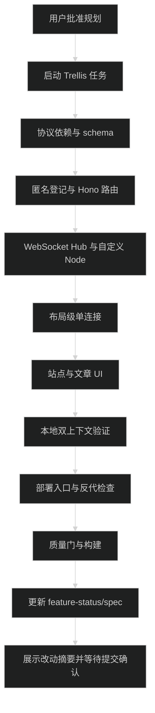

# 执行计划：访客统计与文章实时在线状态

## 开始条件

- [x] 用户明确批准更新后的 `prd.md`、`design.md` 和 `implement.md`；批准计划不等于批准提交代码。
- [x] 运行 `python3 ./.trellis/scripts/task.py start 09-11-visitor-analytics-presence`，确认任务状态变为 `in_progress`。
- [x] 读取任务目录下的规划和研究文件，以及 Trellis 注入的 backend/frontend spec；确认当前工作区没有需要回滚的用户改动。
- [x] 实现前不修改产品源代码、不修改 package scripts、不生成数据库迁移。

## 实现顺序

### 1. 共享协议、依赖和数据库

- [x] 新增 `src/lib/visitor.ts`：公开 bootstrap/stats/snapshot DTO、客户端/服务端 WebSocket 消息类型、状态枚举、cookie 名称、连接路径、heartbeat/TTL 常量和文章路径解析辅助函数。
- [x] 新增 `src/server/infra/db/schema/visitors.ts`，定义 `site_visitor_records`；在 `src/server/infra/db/schema/index.ts` 聚合导出。
- [x] 把 `ws` 声明为直接运行时依赖，把 `tsx` 声明为直接运行时依赖，把 `@types/ws` 声明为开发依赖；只使用已有 lockfile 能解析的版本范围，运行 `pnpm install` 更新锁文件。
- [x] 运行 `pnpm db:generate` 生成迁移；检查迁移只新增访客表，没有改动既有表。
- [x] 运行 `pnpm db:check`，失败时先修复 schema/迁移一致性再进入下一步。

回滚点：如果 schema、lockfile 或迁移不符合预期，只删除本次新增的 schema、依赖声明和迁移文件，不改既有迁移历史；修正后重新生成。

### 2. 匿名登记与 HTTP 路由

- [x] 新增 `src/server/modules/visitors/visitors.types.ts`，定义内部 `ViewerSession`、依赖注入接口、公开 snapshot 和固定错误类型。
- [x] 新增 `src/server/modules/visitors/visitors.service.ts`：
  - 解析或生成 `site_visitor_id`，生成值只在 cookie 响应头中使用。
  - 通过幂等插入登记访客，查询累计数量；不保存 IP、User-Agent、Referer 或 cookie 原文。
  - 维护进程内 `Map`，用可注入 clock、数据库和 session store 方便测试。
  - 按 `visitorId` 计算站点在线人数，按 `visitorId + articleSlug` 计算文章人数。
  - 实现 45 秒 TTL 清理、按 `sessionId + connectionId` 的安全删除和公开快照投影。
  - 让数据库异常转换成固定的 `service_unavailable`，不向 route/WebSocket 抛出 SQL 和内部错误文本。
- [x] 新增 `src/server/modules/visitors/visitors.route.ts`：
  - `POST /bootstrap`：校验 cookie、幂等登记、设置一年 cookie、返回累计数量。
  - `GET /stats`：返回累计人数、进程内在线人数和公开文章人数；可选 slug 必须经 `getBlogPost()` 验证。
  - `GET /socket`：普通 HTTP 请求返回 `426 Upgrade Required`，不伪装成成功的 HTTP 长轮询。
  - 所有响应设置 `Cache-Control: no-store, max-age=0`；错误不返回 cookie、session、SQL 或异常文本。
- [x] 在 `src/server/app.ts` 挂载 `.route('/visitors', visitorsRoute)`，不修改现有 `/api/presence` 路由。
- [x] 新增 `src/server/modules/visitors/visitors.service.test.ts` 和 `visitors.route.test.ts`，覆盖：
  - 首次匿名登记、重复 cookie 幂等和无效 cookie 替换。
  - 同一个访客多个 session 的站点去重。
  - 同一个访客多个 session 查看同一篇文章时的文章去重。
  - 同一访客同时查看两篇文章时，全站计 1、两篇文章各计 1。
  - slug 校验、TTL 过期、leave/close 删除和重复删除幂等。
  - cookie 属性、no-store、426、固定错误响应和数据库异常。
- [x] 把测试文件加入 `package.json` 的 `test` 脚本，保持现有串行测试方式。

回滚点：先只让 service/route 测试通过，再接入 WebSocket；若 Hono 路由挂载破坏现有 `app.request()` 测试，回退 `app.ts` 挂载和新模块，不改旧模块。

### 3. WebSocket Hub 与自定义 Next 入口

- [x] 新增 `src/server/modules/visitors/visitors.websocket.ts`：
  - 使用 `WebSocketServer({ noServer: true, maxPayload: 4096, perMessageDeflate: false })`。
  - 校验精确路径、Origin 和 `site_visitor_id` cookie；缺 cookie 时拒绝升级。
  - 处理 `sync`、`heartbeat`、`leave` 三类消息，严格校验 JSON、sessionId 和文章 slug。
  - 首次合法 sync 后登记 session；路由切换更新 slug；close、leave、TTL 和 ping/pong 失败安全回收。
  - 使用服务端 `ping()`/`pong`/`isAlive` 定时检查失联连接；只在快照变化时广播公开计数。
  - 发送 `snapshot`、固定 error code，不回显请求内容，不记录客户端 IP 或完整请求头。
  - 提供可测试的 `handleUpgrade`、广播和 close 生命周期，不让测试依赖真实 wall clock。
- [x] 新增 `server.ts`：
  - 使用 `next()`、`app.prepare()`、`createServer()`、`app.getRequestHandler()` 和 `app.getUpgradeHandler()`。
  - 默认监听 `127.0.0.1:4400`；`--dev` 开启 Next 开发模式；普通请求交给 Next。
  - `/api/visitors/socket` 交给访客 WebSocket；`/_next` 开发升级交给 Next；未知升级请求销毁 socket。
  - 处理 `SIGTERM`/`SIGINT`，先停止新连接和 WebSocket 定时器，再关闭 socket、HTTP server 和 Next app。
- [x] 修改 `package.json`：`dev` 改为 `tsx server.ts --dev`，`start` 改为 `tsx server.ts`；`build` 保持 `next build`。
- [x] 新增 `src/server/modules/visitors/visitors.websocket.test.ts`，至少覆盖：
  - 带 cookie 的合法升级和缺 cookie/错误 Origin 的拒绝。
  - 首次 sync、heartbeat 不广播无变化快照、文章切换广播新旧计数。
  - 两个连接同一 visitor 的站点/文章去重。
  - 旧连接关闭不能删除同 sessionId 的新连接。
  - leave、close、ping/pong 超时和 TTL 最终移除在线状态。
  - 非法消息和非法 slug 只返回固定 code。
- [x] 增加一个自定义入口 smoke 测试或脚本，验证普通页面、`/_next` 开发升级和访客升级不会互相吞掉事件。

回滚点：若自定义入口导致 Next HTTP 或 HMR 失败，先恢复 `dev`/`start` 到旧命令，保留已通过的 service/route/schema 改动；不要在同一端口另启第二个生产实时服务。

### 4. 布局级客户端连接

- [x] 新增 `src/app/(site)/_components/visitor/visitor-presence-provider.tsx`：
  - 每个站点布局实例只创建一个 tab 级 `sessionId` 和一个原生 `WebSocket`。
  - 挂载时先 `POST /api/visitors/bootstrap`，成功后连接当前 origin 的 `/api/visitors/socket`。
  - 使用 `usePathname()` 提取 `/blog/:slug`，初次连接和路由变化发送 `sync`；其他路径同步 `null`。
  - 页面可见时每 10 秒发送 heartbeat；隐藏时停止 heartbeat 并关闭连接，重新可见时 bootstrap 后重连。
  - 断线使用 1、2、4、8、15 秒封顶的指数退避；成功连接后清零退避；Provider 卸载时关闭连接。
  - 暴露 `connecting`、`connected`、`unavailable`、公开 snapshot 和文章计数读取 hook；不暴露 visitorId、sessionId 或内部错误。
  - 使用 `cache: 'no-store'` 和请求超时；WebSocket 失败不会阻塞正文、评论或 Mac Presence。
- [x] 在 `src/app/(site)/layout.tsx` 挂载 Provider，不能为每篇文章卡片创建 tracker 或连接。

回滚点：若连接初始化影响首屏或路由切换，先移除 layout 的 Provider 挂载，保留 HTTP、WebSocket server 和 schema 供单独验证；不改文章内容读取。

### 5. 统计展示和视觉验收

- [x] 新增 `visitor-stats.tsx`，从 Provider 读取累计匿名访客数、当前在线人数和连接状态；数据库/连接不可用时不显示绿色在线点或伪造零。
- [x] 新增 `article-viewer-count.tsx`，接收 slug 并从 Provider 读取 `articleViewerCounts`；列表只在大于零时显示紧凑状态，详情页固定显示零状态。
- [x] 在 `site-stats.tsx` 增加动态统计，不改变现有文章、笔记、标签数量和层级。
- [x] 在 `post-card.tsx` 元数据区域增加固定尺寸的文章在线状态，保证人数变化不挤压标题和日期。
- [x] 在 `blog/[slug]/page.tsx` 的文章元数据附近加入当前文章人数。
- [x] 使用 `lucide-react` 的 `CircleHelp` 提供状态说明入口；支持键盘焦点、Escape、外部点击关闭、合适的 aria 属性和 reduced motion。
- [x] 检查桌面、390px 窄屏、亮色和暗色；确认文案、数字、状态点、文章标题、日期、标签没有重叠、溢出或因数字变化跳动。
- [x] 使用 `ego-browser` 做双浏览器上下文验证：
  - A 打开首页，确认 bootstrap、WebSocket、累计访客和站点在线状态。
  - B 打开同一篇文章，确认站点人数和文章人数增加；再用独立上下文打开同文，确认文章按访客去重规则变化。
  - 在文章之间切换，确认旧 slug 回落、新 slug 增加；隐藏/关闭页面后在 TTL 内回落。
  - 刷新同一浏览器，确认 cookie 去重累计访客。
  - 暂停 WebSocket 或让 bootstrap 失败，确认正文和既有 Mac Presence 仍可用且状态显示不可用。

### 6. 部署合同与项目规范

- [x] 更新 `.trellis/spec/frontend/deployment-guidelines.md`：将运行入口从直接 `next start` 改为 `pnpm start`/自定义 `server.ts`，补充本机 WebSocket smoke test、`tsx` 运行时依赖和 standalone 限制。
- [x] 确认服务器 `xdd-blog.service` 的 `ExecStart` 不是直接 `next start`。若是，按部署授权修改为 `pnpm start` 或等价路径，运行 `systemctl daemon-reload`，只重启现有服务，不增加第二进程。
- [x] 检查 Caddy 私有配置保留 `reverse_proxy 127.0.0.1:4400`，没有删除 Upgrade 头或设置过短的 WebSocket stream timeout；使用 `caddy validate` 后再 reload。
- [x] 不修改 GitHub Actions 的 secrets、数据库环境变量或 Mac Presence 隧道；现有 workflow 继续执行 install、migration、build、systemd restart 和 HTTP health check。
- [x] 更新 `.trellis/spec/frontend/feature-status.md`，记录真实实现文件和部署前置条件；若实现产生可复用的新约定，再通过 `trellis-update-spec` 更新对应 spec。

回滚点：服务端代码回滚时同步恢复 systemd 入口；Caddy 只回滚本任务引入的 upgrade 相关配置（若有），不删除现有通用反代，不回滚访客迁移。

### 7. 集成验证与完成

- [x] 本地先运行 `pnpm dev`，确认页面、HTTP API、WebSocket 和开发 HMR 都正常。
- [x] 运行 `pnpm build` 后用 `pnpm start` 启动生产模式，验证普通 HTTP、bootstrap、stats 和 WebSocket。
- [x] 本机使用 WebSocket 客户端验证 cookie、sync、snapshot、文章切换、close 和重连；不打印 cookie、IP 或完整请求头。
- [ ] 服务器发布前只读检查 unit、端口和 Caddy 配置；发布后检查 `systemctl is-active`、本机 HTTP 200、本机 WebSocket handshake 和公网 `wss` 连接（部署后执行）。
- [x] 按项目要求依次运行：
  1. `pnpm typecheck`
  2. `pnpm lint`
  3. `pnpm format:check`
  4. `pnpm db:check`
  5. `pnpm test`
  6. `pnpm build`
- [x] 运行 `node .pi/skills/impeccable/scripts/detect.mjs --json`，只处理本任务引入的 UI 反模式。
- [x] 运行 `git diff --check` 和 `git status --short`，确认没有未授权文件；记录所有检查结果和未能验证的生产外部条件。

## 完成阶段

- [x] 最后一次执行 Trellis quality check，确认需求、设计、实现计划、代码、迁移、测试和部署合同一致。
- [x] 必要时运行 `trellis-update-spec`，只记录代码中已经验证的长期约定。
- [x] 向用户展示改动摘要、验证命令和结果，获得明确确认后才能执行 `git commit`；用户未确认前不提交、不推送。
