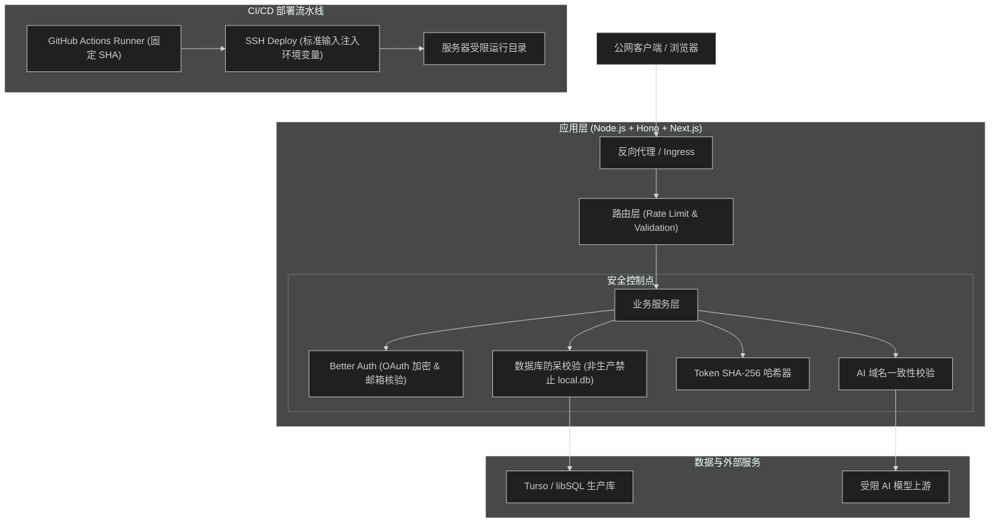
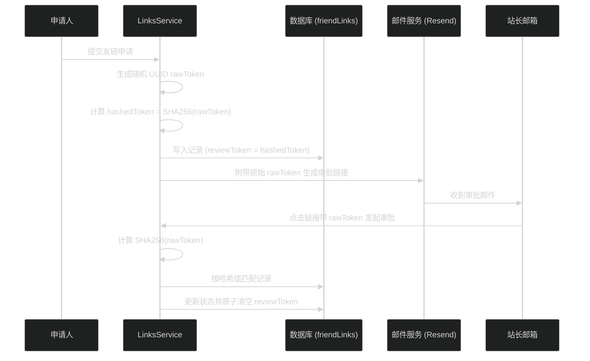
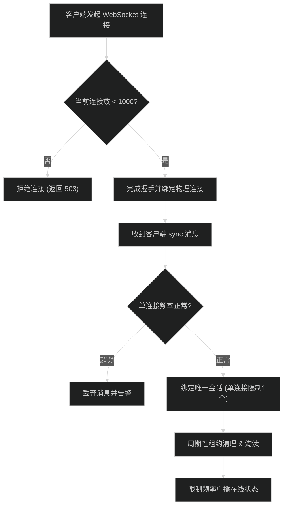
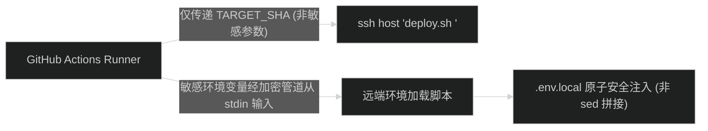

# 项目与 CI/CD 综合安全加固技术设计

## 总体架构与防护边界

加固方案在请求接入、鉴权校验、业务存储、外部出站与 CI/CD 发布五个边界设置纵深防御措施：

---

## 阶段一：应用鉴权、存储安全与防呆设计

### 1. 生产数据库配置防呆熔断
- **文件**：`src/server/infra/db/client.ts`、`drizzle.config.ts`、`scripts/verify-db.mts`。
- **机制**：
  - 判断 `isProduction = process.env.NODE_ENV === 'production'`。
  - 若为生产模式，`url` 必须存在且不得以 `file:` 开头；`token` 必须非空。
  - 遇到不合规配置时立即抛出 `Error('[Database] 生产环境缺少有效的 TURSO_DATABASE_URL 或 TURSO_AUTH_TOKEN 配置，服务拒绝启动')`。

### 2. 友链审批 Token 哈希化存储
- **文件**：`src/server/modules/links/links.service.ts`、`src/server/modules/links/links.types.ts`。
- **数据流**：

### 3. AI 摘要切换 Base URL 防旧凭据外泄
- **文件**：`src/server/modules/ai/summary-config.service.ts`。
- **校验逻辑**：
  - 对传入的 `input.baseUrl` 与数据库现存的 `existing.baseUrl` 做 URL 标准化比对（提取 `origin`）。
  - 若请求未提供 `apiKey` 且两者的 `origin` 不相同，则明确抛出 `AiSummaryConfigError('CREDENTIAL_REQUIRED', '更换 Base URL 时必须同时提供对应的 API Key', 400)`。
  - 严禁在变更目标域名后直接使用旧凭据发往新地址。

### 4. Better Auth 与站长权限加固
- **文件**：`src/server/modules/auth/auth.service.ts`、`src/server/modules/auth/auth.config.ts`。
- **改动**：
  - `isSiteAdminUser` 同时判断 `session.user.email === ADMIN_EMAIL` 与 `session.user.emailVerified === true`。
  - `auth.config.ts` 中移除 `requireLocalEmailVerified: false`，默认开启邮箱核验证。
  - 开启 `account: { encryptOAuthTokens: true }`，对入库的第三方 OAuth Token 自动启用密文存储。

### 5. 诊断接口脱敏
- **文件**：`src/server/modules/system/system.route.ts`。
- **改动**：
  - `/api/system/db-check` 成功时仅返回 `{ status: 'connected', latencyMs }`。
  - 失败时返回脱敏文案 `createFailureResponse('数据库连通性异常', 503)`，底层异常信息仅通过 `console.error` 记录在服务端。

---

## 阶段二：运行时频控、资源上限与日志脱敏

### 1. 访客 Bootstrap 与 WebSocket 资源防护
- **文件**：`src/server/modules/visitors/visitors.route.ts`、`src/server/modules/visitors/visitors.service.ts`、`src/server/modules/visitors/visitors.websocket.ts`。
- **机制**：
  - **Bootstrap 频控**：基于内存滑动窗口限流器，限制同一 IP 每分钟最多调用 30 次 bootstrap。
  - **总数缓存优化**：首次登记新访客时，对内存缓存计数器执行递增，而非每次都全表查询 `count()`。
  - **单物理连接限制**：每个 WebSocket 连接（`wsId`）仅允许绑定 1 个客户端会话（`sessionId`）。收到新的 `sessionId` 广播请求时直接覆盖或更新原有会话，防止单连接持续创建海量假会话。
  - **全局连接与会话硬上限**：
    - 最大活跃 WebSocket 连接数设为 1000。超出时拒绝新的 Upgrade 请求并返回 503。
    - 内存 `sessions` 映射设置上限 2000。清理过期租约后若仍超出上限，按 LRU 或时间戳淘汰最老记录。

### 2. 友链申请与评论提交限流
- **文件**：`src/server/modules/links/links.rate-limit.ts`、`src/server/modules/comments/comments.rate-limit.ts`（新增）。
- **设计**：
  - 友链申请内存映射设置容量硬上限（5000），满载时主动剔除过期项；全部未过期时拒绝新 IP 插入并返回 429。
  - 新增评论提交频控中间件，对同一用户 ID 限制每分钟最多 5 条，同一客户端 IP 每分钟最多 10 条。

### 3. 邮件发送日志脱敏
- **文件**：`src/server/infra/email.ts`。
- **设计**：
  - 降级模拟发送时，判断 `process.env.NODE_ENV === 'production'`：若为生产环境，严禁打印申请人真实姓名、邮箱地址与简介正文；仅打印脱敏诊断：`[FriendApply Email Mock] 生产环境未配置邮件发送服务，申请已忽略投递`。

---

## 阶段三：CI/CD 部署流水线加固

### 1. GitHub Actions 固定完整 Commit SHA
- **文件**：`.github/workflows/ci-cd.yml`。
- **改动**：
  - `actions/checkout@v4` -> `actions/checkout@11bd71901bbe5b1630ceea73d27597364c9af683 # v4.2.2`
  - `pnpm/action-setup@v4` -> `pnpm/action-setup@a7487c7e89a18df5e30492777809294966de973c # v4.0.0`
  - `actions/setup-node@v4` -> `actions/setup-node@39370e3970a6d050c480ffad4ff0ed4d3fdee5af # v4.1.0`

### 2. 构建脚本依赖最小化
- **文件**：`pnpm-workspace.yaml`、`.github/workflows/ci-cd.yml`。
- **改动**：
  - 从 `allowBuilds` 中移除 `@prisma/client` 与 `better-sqlite3`，只保留 `esbuild: true` 与 `sharp: true`。

### 3. SSH 敏感环境变量安全传输
- **文件**：`.github/workflows/ci-cd.yml`。
- **问题**：原脚本使用 `ssh ... bash -s -- "$TARGET_SHA" "$VAR1" "$VAR2" ...` 将全部 Secrets 放在命令行参数中。
- **加固方案**：

- 将环境变量通过标准输入（stdin）逐行以 Key-Value 格式喂给远端处理脚本，并在远端使用精确读取逻辑安全追加/更新，杜绝命令行 argv 泄露与 shell 元字符注入。
