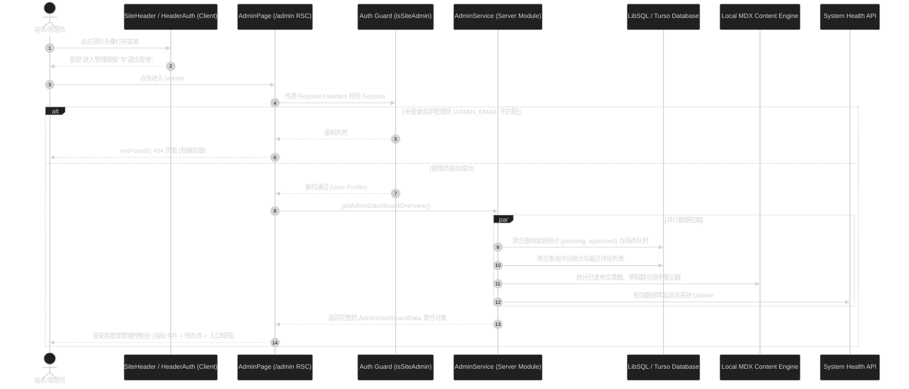

# 管理员管理面板技术方案设计 (Design Specification)

## 1. 架构总览与数据流

管理面板作为一个纯服务端渲染优先（Server Component First）的高内聚模块，直接依托 Next.js App Router 服务端运行时。其核心数据流架构如下：



## 2. 目录组织与模块划分

严格遵循项目架构规则：
- 服务端业务模块放 `src/server/modules/admin/`；
- 页面路由放 `src/app/(site)/admin/`；
- 专属私有组件放 `src/app/(site)/_components/admin/`；
- 共享认证组件在 `src/app/(site)/_components/site/header-auth.tsx`。

```
src/
├── app/
│   └── (site)/
│       ├── admin/
│       │   └── page.tsx                    # 管理后台主入口 (RSC, 鉴权守卫 + 数据聚合装配)
│       └── _components/
│           ├── admin/
│           │   ├── admin-header.tsx        # 控制台标题、站长身份与环境实时指示条
│           │   ├── admin-metrics.tsx       # 全站核心资产指标卡片 (文章/笔记/评论/友链/访客)
│           │   ├── admin-pending-links.tsx # 待审核友链申请快捷处理队列
│           │   ├── admin-recent-comments.tsx # 全站最新评论监控流
│           │   ├── admin-portal-matrix.tsx # 5 大功能管理台入口卡片矩阵
│           │   └── admin-quick-actions.tsx # 顶部快捷操作栏 (刷新、返回前台、清除缓存)
│           └── site/
│               └── header-auth.tsx         # 顶栏头像菜单：集成"进入管理面板"
└── server/
    └── modules/
        └── admin/
            ├── admin.service.ts            # 服务端数据聚合逻辑 (Promise.all 批处理)
            ├── admin.types.ts              # 管理面板强类型契约
            └── admin.test.ts               # 服务端聚合逻辑单元测试
```

## 3. 服务端数据契约设计 (`admin.types.ts`)

```typescript
export interface AdminDashboardData {
  /** 站长个人信息摘要 */
  adminUser: {
    name: string
    email: string
    image?: string | null
  }
  /** 系统运行环境指标 */
  system: {
    nodeVersion: string
    platform: string
    uptimeSeconds: number
    dbLatencyMs: number
    dbStatus: 'connected' | 'error'
    dbProvider: 'turso' | 'local-sqlite'
  }
  /** 全站内容与资产统计 */
  content: {
    totalPosts: number
    publishedPosts: number
    draftPosts: number
    totalNotes: number
    categoryDistribution: Record<string, number>
  }
  /** 社交与互动数据 */
  engagement: {
    totalComments: number
    activeComments: number
    deletedComments: number
    totalFriends: number
    pendingFriendsCount: number
  }
  /** AI 服务就绪状态 */
  aiService: {
    masterKeyConfigured: boolean
    status: 'ready' | 'needs_check' | 'no_credential'
    modelId: string
    protocol: string
  }
  /** 待办队列：待审核友链 (至多 5 条) */
  pendingFriendLinks: Array<{
    id: number
    name: string
    url: string
    ownerName: string
    email: string
    description: string
    hasAddedUs: boolean
    reviewToken: string | null
    createdAt: number
  }>
  /** 动态流：全站最新评论 (至多 5 条) */
  recentComments: Array<{
    id: number
    targetKey: string
    authorName: string
    authorImage: string | null
    contentSnippet: string
    createdAt: number
    isPinned: boolean
  }>
}
```

## 4. 服务端数据聚合实现 (`admin.service.ts`)

采用 `Promise.all` 高并发拉取各子系统数据，同时做好容灾降级，单项模块异常不导致整页崩溃：

```typescript
export async function getAdminDashboardData(user: { name?: string | null; email?: string | null; image?: string | null }): Promise<AdminDashboardData> {
  const [
    dbCheck,
    sysProcess,
    aiConfig,
    friendsStats,
    pendingLinks,
    commentsStats,
    recentCommentsList,
  ] = await Promise.all([
    checkDatabase().catch(() => ({ status: 'error' as const, latencyMs: -1, provider: 'turso' as const })),
    Promise.resolve(getSystemProcessHealth()),
    getAiSummaryConfig().catch(() => null),
    fetchFriendLinksStats(),
    fetchPendingFriendLinks(5),
    fetchCommentsStats(),
    fetchRecentComments(5),
  ])

  const posts = getAllBlogPosts()
  const notes = getAllNotes()

  // 组装最终聚合对象
  return { ... }
}
```

## 5. 安全守卫与权限机制 (Security Guard)

1. **服务端前置校验**：
   在 `src/app/(site)/admin/page.tsx` 首行：
   ```typescript
   const reqHeaders = await headers()
   const session = await getSession(reqHeaders)

   if (!session?.user?.id || !isSiteAdmin(session.user)) {
     notFound()
   }
   ```
2. **隐蔽策略 (Stealth Security)**：
   - 不返回 403 Forbidden，不展示“你没有权限访问该页面”的登录指引，而是直接抛出 `notFound()` 渲染 Next.js 404 页面；
   - 彻底防止恶意爬虫、扫描器探测后台路由的存在；
   - 未配置 `ADMIN_EMAIL` 环境变量时，默认任何人均无法进入后台。
3. **搜索引擎防御**：
   - 页面导出 `metadata` 声明：
     ```typescript
     export const metadata: Metadata = {
       title: '管理面板 · 控制台',
       robots: {
         index: false,
         follow: false,
         nocache: true,
         googleBot: { index: false, follow: false },
       },
     }
     ```

## 6. 前端组件与界面设计 (UI & Craftsmanship)

严格践行 `impeccable` 与 `emilkowalski-emil-design-eng` 的工匠级标准：

### 6.1 色彩与主题自适应
- 基于 Catppuccin 调色板，背景采用微透明渐变与毛玻璃面板（`bg-card/40 backdrop-blur-md border-border/70`）；
- 状态指示灯严格统一：
  - 绿色（`emerald`）：运行正常、就绪、已审核、在线；
  - 黄色（`amber`）：待处理、需要检查、草稿；
  - 红色（`rose`）：错误、掉链、异常；
  - 蓝色/紫色（`primary / sky`）：站长标识、核心数据指标。

### 6.2 界面组件分层
1. **AdminHeader**：
   - 展现微小代码标识 `// CONSOLE / WORKSPACE`；
   - 站长头像、昵称、已验证邮箱与黄金“站长”勋章；
   - 悬浮胶囊：展示 Node 版本、数据库延迟 `ping: 28ms`、运行 Uptime。
2. **AdminMetrics**：
   - 4 栏响应式 Bento 网格；
   - 数字采用等宽或加粗现代字体，悬浮微放大；
   - 展示公开文章数、草稿数、笔记数、有效评论数、友链数。
3. **AdminPendingLinks**：
   - 待审核友链专用卡片；
   - 若有待审核项，显示申请人昵称、站点地址、提交时间，附带直达审批的快捷链接按钮；
   - 若空闲，显示圆润的绿色勾选徽章。
4. **AdminRecentComments**：
   - 呈现全站最新 5 条评论；
   - 带有作者头像、昵称、发表文章关联；
   - 鼠标悬浮展示优雅的淡灰色背板反馈。
5. **AdminPortalMatrix**：
   - 5 大管理台卡片：AI 摘要配置（`/settings/ai`）、友链管理（`/links`）、评论监管、访客监控（`/status`）、系统诊断；
   - 每个卡片具备清晰的图标、分类标识、当前子系统健康参数及操作按钮。

### 6.3 顶栏 `HeaderAuth` 下拉菜单改造
- 原有：
  - 作者登录时显示 `AI 摘要配置` (`/settings/ai`)；
- 改造后：
  - 作者登录时展示：
    1. 用户资料头部（头像、昵称、邮箱、作者徽章）；
    2. **「管理面板」**（`LayoutDashboard` 图标，跳转 `/admin`）；
    3. **「AI 摘要配置」**（保留作为高频直达项，`Settings` 图标，跳转 `/settings/ai`）；
    4. 分割线；
    5. **「退出登录」**（`LogOut` 图标，处理退出请求）。

## 7. 异常降级与边界处理

- **数据库连通失败**：如果 Turso / SQLite 异常，`AdminService` 捕获异常，`dbStatus` 标记为 `error`，控制台仍然能渲染文章/笔记等静态 MDX 指标，并在状态条中明确提示“数据库离线”，避免管理面板完全白屏。
- **缺失主密钥**：AI 摘要配置卡片显示“未配置主密钥”，提示进入 `/settings/ai` 检查环境变量。
- **无待办或无评论**：优雅呈现空状态（Empty States），不留突兀的空白或破碎排版。
