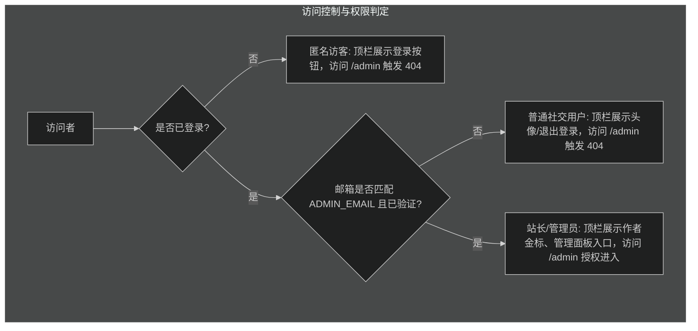

# 需求文档：管理员管理面板 (Admin Dashboard)

## 背景与目标

喜东东小站目前已具备多项动态与管理能力：
- 基于 Better Auth 的社交认证（GitHub / Google），以及基于 `ADMIN_EMAIL` 校验的管理员（站长）权限判定；
- AI 文章摘要配置与模型管理（`/settings/ai`）；
- 友链申请与邮件一键审批机制（`site_friend_links` 表与 7 天一次性审批令牌）；
- 评论系统与违规软删除机制（`site_comments` 表与删除令牌）；
- 全站实时在线访客（WebSocket）与 Mac 实时活动采集（Presence 服务）；
- 系统健康状态监测（libSQL/Turso 数据库连通性、进程健康与 Uptime）。

**当前痛点**：
管理员登录后，仅在顶栏头像下拉菜单中硬编码了一个单一的"AI 摘要配置"链接。缺乏统一的站长管理工作台，导致：
1. 站长无法直观掌控博客的内容资产（文章数、草稿数、笔记数）；
2. 友链申请如果有 pending 待审批，只能等邮件通知，无法在控制台统一查看待办；
3. 全站最新评论分散在各个独立文章页，没有统一的监控与最近动态流；
4. 系统状态、数据库延迟、实时在线人数和 AI 服务状态割裂，缺乏总览与统一导航枢纽。

**本任务目标**：
1. 打造专供站长访问的**统一管理面板（`/admin`）**，具备数据大盘指标、待办事务通道、全站功能管理台入口矩阵与系统诊断流；
2. 联动顶栏右上角用户头像下拉菜单（`HeaderAuth`），管理员登录后提供清晰的"管理面板"直达入口与退出登录选项；
3. 实施隐蔽式服务端权限守卫：未登录或非管理员访问一律调用 Next.js 原生 `notFound()`，对外隐藏管理面板的存在；
4. 页面元数据严格配置搜索引擎防索引（`noindex, nofollow`）。

## 用户角色与权限

## 功能需求规格

### 1. 顶栏头像下拉菜单联动 (`HeaderAuth`)
- **未登录状态**：保持不变，显示登录图标按钮，点击唤起社交登录弹窗。
- **普通用户登录状态**：
  - 头像与昵称展示；
  - 邮箱脱敏/完整展示；
  - 仅显示"退出登录"按钮。
- **管理员用户登录状态 (`isOwner === true`)**：
  - 头像右下角保留站长专属光标角标；
  - 下拉面板首部展示"站长 / 作者"身份徽标及邮箱；
  - **核心操作项**：
    - **进入管理面板**：图标 `LayoutDashboard`，点击跳转 `/admin`，自动关闭菜单；
    - **AI 摘要配置**（快捷通道）：图标 `Cpu`，点击跳转 `/settings/ai`，自动关闭菜单；
  - **分割线**；
  - **退出登录**：图标 `LogOut`，带 loading 状态防止重复提交。

### 2. 管理面板页面结构与内容规划 (`/admin`)

管理面板采用一体化控制中心（Admin Control Hub）布局，按优先级自上而下组织：

#### 2.1 头部工作区标识与全局状态 (Admin Header)
- 标识符：`// CONSOLE / WORKSPACE · SYS_ADMIN`
- 大标题：`管理面板`（配简明副标题，显示当前服务器时间、运行环境及管理员身份信息）
- 顶部环境指标栏（轻量实时胶囊）：
  - 数据库连通性（显示 `Turso / SQLite` 状态与实时 `ping` 延迟，如 `24ms`）；
  - 进程运行时间（Uptime，格式化为天、小时、分钟）；
  - 运行环境标识（`Node.js` 版本、`production / development`）。

#### 2.2 资产与运营核心指标大盘 (Metric Cards)
采用 4 格响应式指标卡片，直观展示全站运营核心数据：
1. **文章资产**：已发布公开文章数（展示各分类分布如技术/捣鼓/随想）与草稿文章数；
2. **随想笔记**：已发布公开笔记数；
3. **互动评论**：全站累计有效评论数、今日新增评论数及已软删除评论数；
4. **社交友链与访客**：已上线友链数、待审核友链数、当前全站实时在线人数与历史独立访客数。

#### 2.3 站长待办与动态速览 (Action Required & Recent Stream)
包含两个高优先级工作区：
1. **待审核友链申请（Pending Review Queue）**：
   - 若有待处理申请：卡片以醒目边框突出，列出待办列表（申请人昵称、站点名称、站点 URL、申请时间、是否已添加本站链接）；
   - 提供直达审批页面的操作通道（带 token 快捷入口或一键审批链接）；
   - 若无待处理申请：展示绿色就绪徽章（"当前暂无待处理友链申请"）。
2. **全站最新评论动态（Recent Comments Stream）**：
   - 提取全站最近 3~5 条评论动态；
   - 呈现评论者头像、昵称、发表于哪篇文章（附带文章标题与链接）、评论内容摘要及相对时间（如"10分钟前"）；
   - 支持点击快速跳转至原文章评论区进行管理或回复。

#### 2.4 各功能管理台入口卡片矩阵 (Portal Matrix)
提供 5 大标准化功能入口卡片，卡片均包含分类标签、状态灯、图标、标题、职责描述、核心参数指示与跳转动作：
1. **AI 摘要配置管理台**：
   - 分类：`CONTENT / AI SERVICES`
   - 指标：主密钥状态（`已就绪 / 缺失`）、配置模式、当前所选协议与模型名
   - 动作：跳转 `/settings/ai`，直接管理 API Key、BaseUrl 与模型连通性测试
2. **友链审批与管理中心**：
   - 分类：`ENGAGEMENT / LINKS`
   - 指标：已上线友链总数、待审批数量
   - 动作：跳转 `/links`，处理友链上线与展示
3. **评论监管与互动管理**：
   - 分类：`ENGAGEMENT / COMMENTS`
   - 指标：有效评论总数、软删除记录数
   - 动作：跳转至博客文章列表或特定文章进行评论置顶与清理
4. **实时访客与活动监控台**：
   - 分类：`MONITOR / PRESENCE`
   - 指标：当前在线访客数、Mac 活动采集状态（当前应用与专注度）
   - 动作：跳转 `/status` 查看系统状态大屏
5. **系统健康与基础设施**：
   - 分类：`SYSTEM / INFRASTRUCTURE`
   - 指标：数据库状态、内存堆占用、Node 版本
   - 动作：跳转 `/status` 查看各底层服务连通性

## 非功能需求

1. **安全性与隐蔽性**：
   - 服务端组件优先渲染，不在客户端暴露管理面板页面路由存在；
   - 非管理员访问时直接触发 Next.js `notFound()`，返回与普通 404 完全一致的响应页面；
   - 页面导出 `robots: { index: false, follow: false, nocache: true }`，严禁任何搜索引擎爬取。
2. **性能与渲染体验**：
   - 纯 Server Component 聚合数据，直接调用底层 Service 查询，无客户端瀑布流请求；
   - 零 Layout Shift，页面骨架与 Catppuccin 四主题完美贴合；
   - 支持移动端与桌面端自适应排版。
3. **可维护性与代码整洁**：
   - 业务聚合逻辑收敛在 `src/server/modules/admin/` 模块，高内聚低耦合；
   - 页面组件严格按项目规范放入 `src/app/(site)/_components/admin/`，不污染公共目录。

## 验收标准

- [ ] **鉴权拦截**：未登录访问 `/admin` 时返回 404 Not Found 页面。
- [ ] **权限隔离**：已登录但非管理员的普通用户访问 `/admin` 时返回 404 Not Found 页面。
- [ ] **管理授权**：管理员登录后访问 `/admin` 正常呈现完整管理面板。
- [ ] **顶栏菜单**：管理员登录后点击头像，下拉菜单出现"进入管理面板"与"退出登录"，且能顺畅跳转到 `/admin`。
- [ ] **数据大盘**：管理面板正确聚合显示文章数、笔记数、评论数、友链数与待办申请。
- [ ] **待办队列**：有待审核友链时突出呈现列表与审批跳转；无待办时展示绿色就绪状态。
- [ ] **动态流**：正确呈现最新评论列表并能跳转对应文章。
- [ ] **功能卡片**：AI 配置、友链、评论、访客与系统等卡片状态指示准确、链接跳转有效。
- [ ] **代码质量**：通过 `pnpm typecheck`、`pnpm lint`、`pnpm format:check`、`pnpm test` 全部门禁检查。
